# PR0L1NE

PR0L1NE is a split-screen tool for seeing your code's data while you write it. Python, JavaScript or TypeScript goes in the editor. Next to it, a graph-paper canvas draws every variable, list, dict, object, function and scope as SVG. When your code is inside a loop, each iteration is stacked under the last one with red arrows showing exactly what changed. Or switch to animated mode and press **Play** to watch values slide into place step by step.

Binary trees are drawn top-down. Graphs (adjacency lists, matrices, tries, graphs of objects) are drawn as nodes and edges, with your algorithm's own state on them: the visited set filled in, the queue numbered, distances labeled, the search tree in green. Generators and `async` functions get their own frames that pause and resume, and `# viz:` / `// viz:` comments let you tell the canvas how to draw things when its automatic choices aren't what you want.

It also estimates your code's **time and space complexity** (O(n²), O(n log n), O(V + E)) from the shape of the code, checks the estimate against the run, and labels every loop and function in the editor with what it costs.

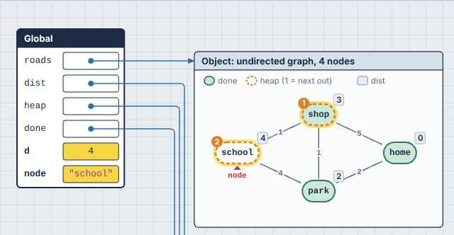

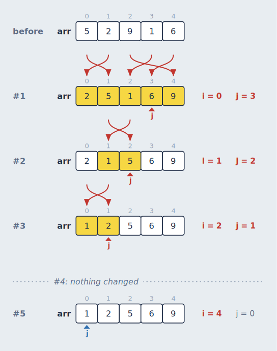

It runs entirely in your browser, so there's no server to set up. Python executes in a real CPython interpreter compiled to WebAssembly ([Pyodide](https://pyodide.org)). JavaScript runs in the browser's own engine, after PR0L1NE rewrites it to report on itself as it runs. TypeScript has its types removed and then runs the same way.

---

## Contents

1. [Quick start](#quick-start)
2. [Using it](#using-it)
3. [Hints: `viz:` comments](#hints-viz-comments)
4. [How it works](#how-it-works)
5. [Project structure](#project-structure)
6. [Development workflow](#development-workflow)
7. [Extending it](#extending-it)
8. [Limitations](#limitations)
9. [Troubleshooting](#troubleshooting)
10. [Roadmap ideas](#roadmap-ideas)

---

## Quick start

### Requirements

- **Node.js 20 or newer** and npm (check with `node --version`).
- **An internet connection** the first time you use Python. The page downloads Pyodide (about 10 MB) from the jsDelivr CDN, and your browser caches it after that. JavaScript and TypeScript need no download.
- **A modern browser**: recent Chrome, Edge, Firefox or Safari. Code runs in ES module workers, which need Firefox 114+ or Safari 15+.
- **Optional: Python 3.12** if you want to run the Python tracer's tests or inspect Python traces from the command line. The app itself doesn't need Python installed, because Python runs inside the browser.

### Install and run

```bash
cd algoviz
npm install
npm run dev
```

Open the URL Vite prints (usually http://localhost:5173). Pick **Python**, **JavaScript** or **TypeScript** in the toolbar. With Python, the status in the top-right corner reads "Loading Python…" for a few seconds on the first visit, then shows the Python version. JavaScript and TypeScript are ready immediately. The bubble sort example runs automatically.

### Other commands

| Command | What it does |
| --- | --- |
| `npm run dev` | Starts the dev server with hot reload. |
| `npm run build` | Type-checks, then builds a static site into `dist/`. |
| `npm run preview` | Serves the built `dist/` folder locally. |
| `npm run typecheck` | Runs the TypeScript compiler without building. |
| `npm test` | Runs all tests: the TypeScript ones, then the Python tracer's under your Python and under Pyodide. |
| `npm run test:js` | Runs the Vitest suites: the JavaScript and TypeScript tracers (including generators, `async` and timers), hints, graphs, memory sizes, complexity estimates (every example, in all three languages), arrow routing, layout of every example, nesting, linked structures, animation and saved programs. |
| `npm run test:tracer` | Runs the Python tracer's unit tests (needs Python 3.12). |
| `npm run test:pyodide` | Runs the same tests inside Pyodide, the Python the browser runs, loaded from the `pyodide` npm package in Node. No local Python needed. |
| `npm run trace -- file.py` | Prints the JSON trace for a Python file (needs Python 3.12). |
| `npm run trace:js -- file.js` | Prints the JSON trace for a JavaScript or TypeScript file (`.ts` files are treated as TypeScript). |
| `npm run instrument -- file.js` | Prints the instrumented version of a JavaScript or TypeScript file. |

The output of `npm run build` is plain static files. You can host `dist/` anywhere that serves static content (GitHub Pages, Netlify, an S3 bucket, `python3 -m http.server`).

---

## Using it

### Choosing a language

The menu at the left of the toolbar switches between **Python**, **JavaScript** and **TypeScript**. Each language keeps its own code, undo history, saved programs and examples, so switching back and forth doesn't lose anything. Python's runtime is only downloaded the first time you pick Python.

The visuals are the same for every language, but JavaScript's semantics show through in a few places (all of these apply to TypeScript too):

- **Block scoping is visible.** A `let` or `const` declared inside a loop or block only appears while that block is running. In the bubble sort, the inner loop's `j` shows up in the inner loop's history but not in the outer loop's, because it doesn't exist there.
- **Variables appear when they're declared.** A `let` or `const` isn't shown until its declaration has run, since reading it earlier is an error in JavaScript. A `var` appears from the start of its function as `undefined`, because that's how hoisting works.
- **Plain objects are drawn as dictionaries.** `{}` is JavaScript's everyday map, so `counts[word]++` gets the same growing-dictionary loop view as a Python dict, with keys shown unquoted. A `Map` is drawn the same way. Instances of your own classes are drawn as objects with fields.

  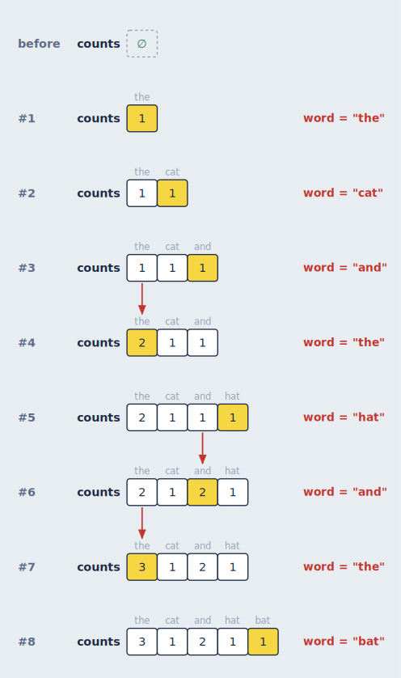
- **Methods show `this`.** Inside a class method or object method, `this` appears as a variable on every step, the way Python shows `self`. Arrow functions inside a method show it too, since they share the method's `this`.
- **Function names come from where they're defined.** `const double = (x) => x * 2` appears as `double()` on the call stack, and class methods appear as `ClassName.method()`.

### TypeScript

TypeScript is traced as the JavaScript it compiles to, so everything in the previous section applies, and types themselves never appear on the canvas. That's not a shortcut: types don't exist while a program runs, so there's nothing to draw. A few things are worth knowing:

- **Types aren't checked.** PR0L1NE removes types without checking them, the way esbuild, Vite and `tsc --noCheck` do. Code with type errors still runs, and you'll see what it actually does. Syntax errors are still reported.
- **Your line numbers are exact.** Removing an `interface` or `type` doesn't shift anything, so the highlighted line is always the one you wrote.
- **Enums are real objects.** An `enum` compiles to an object, so it appears in the heap. Numeric enums map both ways (`Light.Red` is `0` and `Light[0]` is `"Red"`), which you'll see as both kinds of key.
- **Parameter properties work as expected.** `constructor(public val: T, public next: ListNode<T> | null = null) {}` sets the fields without producing extra steps for the generated `this.val = val`.
- **Compiler-generated code is hidden.** The helper functions behind enums and namespaces run without being traced, so they don't clutter the call stack. That also means code *inside* a `namespace` block runs untraced, though its exports work normally.

### Saving programs

Press **Save** or `Ctrl/Cmd + S` to keep the program you're working on. The first time, you're asked for a name. After that, `Ctrl/Cmd + S` saves over it, the way it does in VS Code. `Ctrl/Cmd + Shift + S` always asks for a name, so you can save a copy under a new one.

The program's name sits in the toolbar next to the **Open…** menu. A yellow dot after it means there are unsaved changes, and the dot disappears when you save. A program that hasn't been saved yet is shown as *Untitled*.

**Open…** lists your saved programs for the current language, most recently saved first, followed by the examples. If the program you're leaving has unsaved changes, you're asked before they're discarded. **Delete** appears while a saved program is open. Deleting it keeps the code in the editor as an untitled program, so nothing disappears from the screen until you open something else.

Saved programs are stored in your browser (in `localStorage`), separately for each language. They survive reloads and restarts, but they belong to this browser on this machine, and clearing the site's data removes them. Separately from saving, PR0L1NE always keeps whatever is in the editor, saved or not, so a reload never loses work in progress.

### Examples

The **Open…** menu has 37 to 39 examples per language, grouped by topic. Each one is short enough to step through, and each shows off a different part of the canvas:

| Group | Examples |
| --- | --- |
| Sorting | Bubble sort, insertion sort, merge sort (recursion; generic in TypeScript) |
| Searching and two pointers | Binary search, reversing a string with two pointers, two sum with a hash map, a sliding window, word frequency |
| Linked lists and trees | Reversing a linked list, finding a cycle with fast and slow pointers, binary search tree insert, in-order traversal, a trie |
| Graphs | Breadth-first search with the shortest path, recursive depth-first search, Dijkstra's algorithm, topological sort, a graph of objects |
| Grids and dynamic programming | Grid paths, longest common subsequence, coin change, flood fill (number of islands), Fibonacci with a memo (Python and JavaScript) |
| Functions, classes and generators / async | Recursion, closures, a class with methods, generators; async tasks (`asyncio` in Python; with timers in JavaScript and TypeScript); array callbacks in JavaScript and TypeScript; a generic class and an enum in TypeScript |
| Hints, step by step | Ten examples that teach [hints](#hints-viz-comments), from a single `hide` to every kind of hint at once |

The same topics exist in every language, written the way that language would write them: a `deque` and `heapq` in Python, a `Map` and `Set` in JavaScript, typed `Record`s and generics in TypeScript.

### The editor

The editor on the left is [Monaco](https://microsoft.github.io/monaco-editor/), the editor component VS Code is built on, so VS Code's editing and navigation keys work as you'd expect: multi-cursor (`Ctrl/Cmd + D`, `Alt + Click`), move and copy lines (`Alt + ↑/↓`, `Shift + Alt + ↑/↓`), toggle comments (`Ctrl/Cmd + /`), go to line (`Ctrl + G`), find and replace, bracket jumping, folding, and the command palette (`F1`).

With **Live** checked, the program re-runs 600 ms after you stop typing. Otherwise, press **Run** or `Ctrl + '`. Your code is saved in the browser, so it survives a reload. The **Open…** menu has your [saved programs](#saving-programs) and starter examples that each exercise a different part of the canvas. Opening a program or an example is a normal edit, so `Ctrl/Cmd + Z` brings the previous code back.

PR0L1NE adds a few commands of its own, borrowing VS Code's debugger keys for stepping:

| Keys | Command |
| --- | --- |
| `Ctrl + '` | Run. Works anywhere on the page, not just in the editor, and is `Ctrl` on a Mac too |
| `Ctrl/Cmd + Enter` | Play from the current step. Pressed again while playing, it stops and goes back to the step it started from. Works anywhere on the page |
| `Ctrl/Cmd + S` | Save (asks for a name the first time) |
| `Ctrl/Cmd + Shift + S` | Save as a new program |
| `F10` | Next step |
| `Shift + F10` | Previous step |
| `F1`, then type "AlgoViz" | All of PR0L1NE's commands (their palette names still start with "AlgoViz:"), including first and last step, play/pause, and swapping the panels |

Hint comments that PR0L1NE can't understand get a yellow warning squiggle; hover it to see what was expected (see [Hints](#hints-viz-comments)).

While you step through a run, the editor marks lines with a tint and a bar in the gutter (and a matching mark in the scrollbar):

- **Yellow**: the line that just ran. This is the line whose effects the canvas is showing.
- **Blue**: the line that runs next.

If the same line ran and runs next (a loop around a single statement), it's yellow. The editor scrolls to keep the yellow line in view while you step, unless you're typing.
- **Red**: where an error happened (shown once you reach the last step). The error is also a real diagnostic with a squiggle, so hovering shows the message and `F8` jumps to it.

If you're mid-edit and the code has a syntax error, the canvas keeps showing the last version that ran (dimmed), a banner explains what's wrong, and the line is marked in the editor.

### Layout

The **⇄** button at the right end of the toolbar swaps the editor and canvas, so the canvas can be on the left if you prefer. It's also in the command palette as "AlgoViz: Swap Editor and Canvas". Your choice is remembered.

Drag the divider between the panels to resize them, or focus it with `Tab` and use the arrow keys. Double-click it to go back to the default size. The editor keeps its width when you swap sides, and the width is remembered too. On narrow screens the panels stack vertically, and swapping puts the canvas on top.

Inside the canvas, **Memory** and **Loop history** are separate sections with a divider of their own. It works the same way: drag it, use `↑`/`↓` when it's focused, or double-click to reset. Its position is remembered.

### Styling the canvas

**Style** in the toolbar opens a panel for how the canvas looks. Every change shows up on the canvas as you make it, and is remembered in this browser. The panel floats over the editor, whichever side the editor is on, so the canvas stays fully in view and keeps working while it's open. Close it with **×**, `Esc`, or the **Style** button.

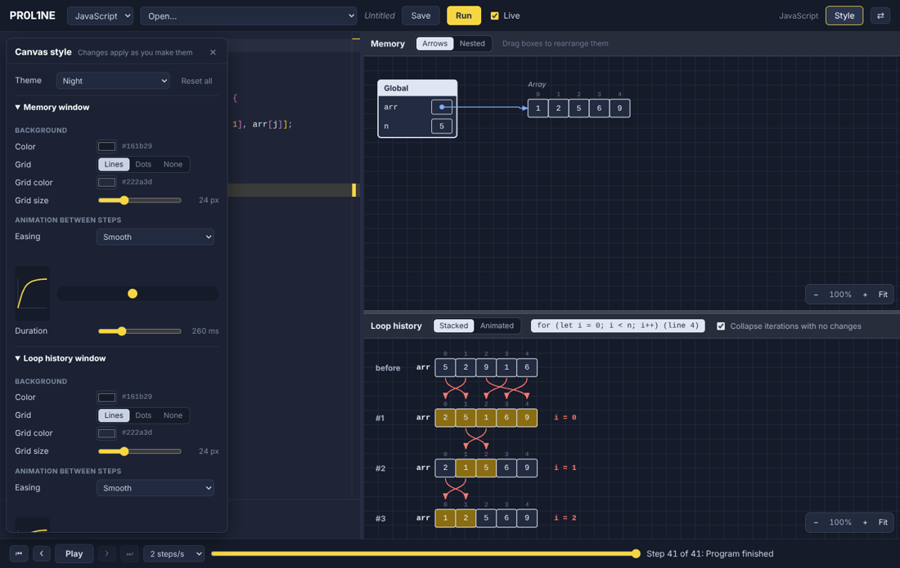

| Section | What you can change |
| --- | --- |
| **Theme** | A starting point: **Graph paper** (the default), **Whiteboard** (white, no grid), **Dot grid**, **Blueprint** (white lines on blue), **Night** (dark) and **High contrast**. Changing anything after that makes it **Custom**. **Reset all** goes back to Graph paper. |
| **Memory window** and **Loop history window**, separately | The **background color**. The **grid**: lines, dots or none, its **color** and its **size** (it still scales with zoom). The **easing** of the animation between steps: Smooth, Linear, Ease in and out, Ease out, Ease in, Overshoot, Snap, or any `cubic-bezier(...)` you type. And its **duration**, from 0 (no animation) to 1000 ms. **Same as the memory window** copies all of it to the loop history. |
| **Colors** | Every color in the diagrams: lines and text, cell and box fills, box titles, function and class titles, numbers, strings and constants, the yellow "changed" highlighter, the red change arrows, the blue references and pointers, the graph colors (visited, waiting, search tree, path), and the text drawn straight on the background (names, labels, index numbers). |
| **Lines and text** | **Arrow thickness** (0.5× to 3×), **box outlines**, **cell corners** (square to round), the **code font** used in the diagrams, and whether changed cells **flash** when they turn yellow. |

**Previewing animation.** Next to the easing menu, a curve shows its shape, and a dot slides back and forth with your easing and duration. **▶ Replay this step** at the bottom redraws the previous step and animates into the current one, so you can watch the real thing. Bubble sort is a good example to try it on, since its swaps slide.

The window headers (the strips with "Memory" and the Arrows | Nested switch) take their colors from each window's background, so a dark theme is dark all the way up.

### Moving around the canvas

Each canvas section is its own sheet of graph paper that you can move around independently:

| To | Do this |
| --- | --- |
| Pan | Drag an empty part of the paper, or scroll (two fingers on a trackpad, `Shift` + scroll to go sideways) |
| Zoom | `Ctrl/Cmd` + scroll, pinch on a trackpad or touch screen, or the **−** / **+** buttons |
| Reset the view | Click the zoom percentage, or press `0` with the section focused |
| See everything | **Fit** shrinks the diagram until it all fits (it never enlarges) |
| Keep everything in view | **Auto-fit** refits on every step (see below) |

With a section focused (click it or `Tab` to it), `+` and `−` zoom too. The arrow keys still step through the program.

Zooming centers on the pointer, so you can zoom into the part you're looking at. Each section keeps its own position and zoom as you step and as your code re-runs. While you step through a loop, the loop history pans just enough to keep the running iteration in view.

#### Auto-fit

**Auto-fit**, next to the zoom buttons, keeps the whole diagram in view on every step. When a step needs a different zoom (a new object appears, a tree grows a level, the loop history gains a row), the canvas glides there with the same easing and duration as that window's step animation in the [Style panel](#styling-the-canvas). The memory view and the loop history each have their own Auto-fit, and both are remembered.

The **▾** next to it picks how it zooms:

- **Zoom out only** (the default) keeps the widest view the run has needed. Stepping back to a small early step, or a diagram that shrinks, doesn't zoom back in, so the picture stays steady while you step back and forth.
- **Zoom in and out** always fits snugly. It zooms back in when the diagram gets smaller.

Like **Fit**, it never zooms in past 100%. Zooming or panning by hand turns Auto-fit off, so it never fights you, and pressing **Auto-fit** turns it back on with a fresh, snug fit. Opening another program also starts fresh.

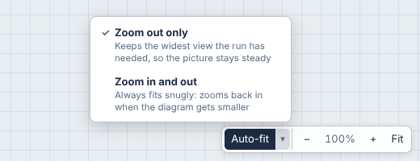

### Rearranging the memory view

Drag any box in the memory view, whether a frame or a heap object, to put it somewhere else. Arrows follow it.

A box stays where you put it as you step through the program, and through live re-runs as you edit, so you can arrange a linked list or a tree the way you think about it and then step through the algorithm. Boxes you've placed are drawn on top of the automatically placed ones, and the boxes you haven't touched keep their usual places. If a new object appears where you've put a box, it's placed below your box instead of being hidden under it. Dropping a box onto another one moves the other one out of the way.

**Reset layout** (next to the zoom controls, shown once you've moved something) puts every box back. Opening a different program or switching language also starts from a fresh layout.

How a box is recognized from one step, or one run, to the next:

- **Frames** by their position on the call stack and function name, so "the third `factorial()` call" keeps its place.
- **Objects** by their id. Ids are numbered in the order objects are first seen (`o1`, `o2`, ...), in every language, so the same program gives the same ids every run. If an edit changes the order objects are created in, a moved position can end up on a different object. **Reset layout** fixes that.

### The timeline

The bar at the bottom moves through the recorded steps. Use the buttons, drag the slider, or use the keyboard: `F10` / `Shift + F10` work everywhere, and `←` / `→` / `Home` / `End` work when the editor doesn't have focus (inside the editor those keys move the cursor). The step description next to the slider has a fixed width, so the slider never changes size as you drag it; hover the description to see all of it when it's cut off.

The timeline starts at **step 3**. Every run begins with "called Global" and "next is line 1", which both show an empty program, so they're skipped: the first step shown is the state after line 1 ran. **First step**, `Home` and replaying from the end all go there.

A step is one of:

- **Ran line N, next is line M**: the state after line N ran, just before line M runs. It matches the editor, where N is yellow and M is blue. The first step of a function just says **Next is line M**.
- **Called f()**: a new function call started, so a new frame appears.
- **f() returns X**: the function is about to return; its frame shows a `returns` row.
- **f() yields X and pauses**: a generator handed a value back; its frame shows a `yields` row and then [pauses](#generators-and-async-functions).
- **f() waits at line N and pauses**: an `async` function reached an `await`.
- **f() resumes at line N**: a paused generator or `async` function picks up where it left off.
- **Error raised on line N**: an exception is propagating.

When you edit code while sitting on the last step, the view stays on the last step of the new run, so you always see the end result of what you just typed.

#### Playing a program

**Play** steps forward on its own at the speed chosen next to it (½, 1, 2, 4, 8 or 16 steps per second; your choice is remembered). `Space` plays and pauses when the editor doesn't have focus, and "AlgoViz: Play / Pause" is in the command palette for when it does. Playback stops at the last step, and pressing Play there starts again from the first step. **`Ctrl/Cmd + Enter`** plays from the step you're on, from anywhere, including the editor. Press it again while it's playing to stop and jump back to the step it started from, so you can watch the same stretch again. Any other way of moving (the buttons, the slider, the keys), editing the code, or running it pauses playback.

Moving one step at a time, whether playing or pressing `F10`, is **animated**: boxes and pointer markers slide to their new places, values that moved within a list slide from their old cell to their new one (so a swap is two values crossing), and new boxes and markers fade in. Arrows don't animate: each one is simply drawn in its new place, so they never flicker. Jumps (dragging the slider, `Home`/`End`) aren't animated, since there's nothing meaningful to tween across many steps. Each animation lasts 260 ms with a smooth ease-out by default (both can be changed per window in the [Style panel](#styling-the-canvas)), or less at high speeds so it always finishes before the next step. If your system asks for reduced motion, nothing animates.

### The memory view

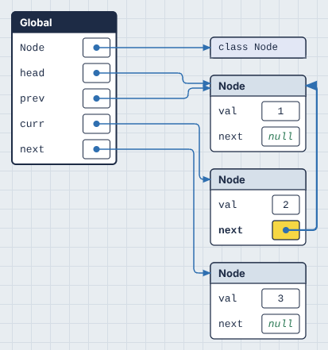

- **Frames** (scopes) are stacked on the left: `Global`, then one box per active function call. The frame that's currently executing has a dark title bar.
- **Primitives** (numbers, strings, booleans, `None`) are drawn inside the variable's cell.
- **Everything else** lives in the heap to the right and is connected by a blue arrow. Lists and tuples are rows of cells with indices above. Dicts, objects and functions are tables. Functions show the variables they've captured from an enclosing scope (closures).
- **Heap objects are arranged in columns by distance from the stack.** Things your variables point at directly sit in the first column, things those point at sit in the second, and so on. That's why a linked list or tree reads left to right.
- **Boxes never overlap.** A new box is placed below anything already in its spot, including boxes you've dragged there.
- **Yellow** means "changed since the previous step." A dashed blue outline means "this object was just created."
- **Index pointers**: small markers under a list show where variables like `i`, `j`, `lo` and `hi` point. See [pointer detection](#pointer-detection) for how these are chosen.
- **Paused generators and `async` functions** are drawn under the call stack as frames with a dashed outline, titled with where they paused. See [Generators and async functions](#generators-and-async-functions).

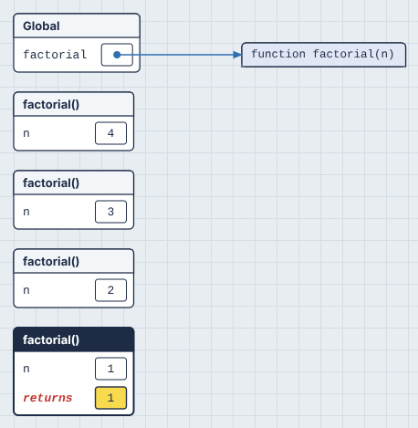

#### Trees

A binary tree is drawn **top-down**, like in a textbook: each node sits at the height of its depth and in its in-order position, so a binary search tree reads sorted from left to right. Arrows leave a node's `left` and `right` cells, drop into the gap below it, and enter each child from the top.

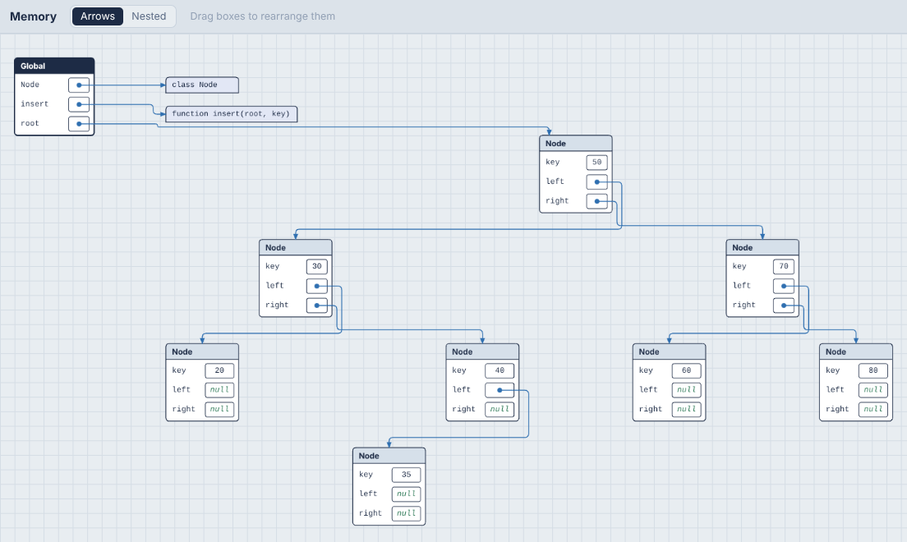

A tree is recognized the same way as in the [loop history](#linked-lists-and-trees): objects of one class with exactly two links to the same class, where no node has two incoming links. A tree with parent pointers has three links, so add a [`viz: tree` hint](#hints-viz-comments) to draw it as a tree. Trees are laid out like this in Arrows mode. Nested mode draws them as boxes in boxes. A single node isn't treated as a tree, and a node you drag leaves the tree layout and stays where you put it.

#### Following the arrows

Arrows are drawn as straight runs with rounded corners, and they travel through the empty gaps between columns, so they don't cut across boxes:

- An arrow to a box on the right runs along its row, turns once in the gap, and enters the box's left side. If the box is level with it, it's a single straight line.
- An arrow to a box in the same column (a linked list being reversed, a node pointing at itself) loops out to the right and comes back into the box's right side.
- An arrow back to an earlier column goes over the top of the boxes in between, or underneath if there's no room above.
- Arrows from list cells leave downward and turn at staggered heights, like the teeth of a comb, so arrows from neighboring cells never run along each other. The leftmost cell turns highest.
- Arrows sharing a gap each get their own lane, ordered to keep crossings down, and arrows arriving at the same box get separate arrowheads.

**Hover over a box** to see what it's connected to. Its arrows, in and out, are highlighted, the boxes at their other ends get a dashed outline, and every other arrow is dimmed. The highlight follows the box while you drag it, and stays as you step through the program with `F10`.

### Arrows or nested boxes

The **Arrows | Nested** switch in the Memory header changes how references are drawn. Your choice is remembered, and `F1` → "AlgoViz: Toggle Nested Memory View" switches it too.

- **Arrows** (the default) draws every object as its own box, with an arrow for every reference.
- **Nested** draws an object *inside* the thing that refers to it, as long as nothing else refers to it. A list in a variable sits right in the variable's row, and an object's fields hold their sub-objects. A list of lists becomes a **grid**: rows stacked, column numbers along the top, row numbers down the side. If your code indexes it as `grid[i][j]`, `i` is marked beside its row, `j` under its column, and their cell gets a dashed outline.

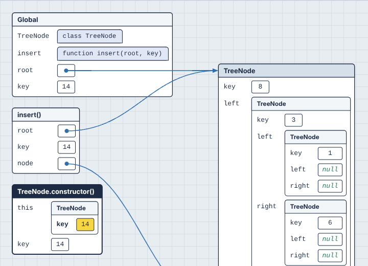

Nesting can only show "this belongs to that", so anything with more than one reference stays a separate box connected by arrows. That covers objects two variables share (aliasing), nodes that `curr` points at while they're also in a list, and cycles. In the tree above, node 10 stays separate because both `root.right` and the variable `node` point at it. That's often exactly what you want to notice: in nested mode, an arrow means "shared".

Nesting stops 6 levels deep. A deeper chain continues in a new box joined by an arrow, and nesting starts again inside it, so a long linked list becomes a few readable boxes rather than a tower.

Boxes still drag the same way in nested mode. Nested objects move with the box they're in.

### Memory sizes

**Sizes** in the memory window's header shows how much memory everything takes, the way the index row shows positions. It's for building intuition: why a list of 1,000 ints is bigger than 1,000 × 8 bytes in Python, how much room a list keeps for growth, what a hash map costs per entry compared to an array.

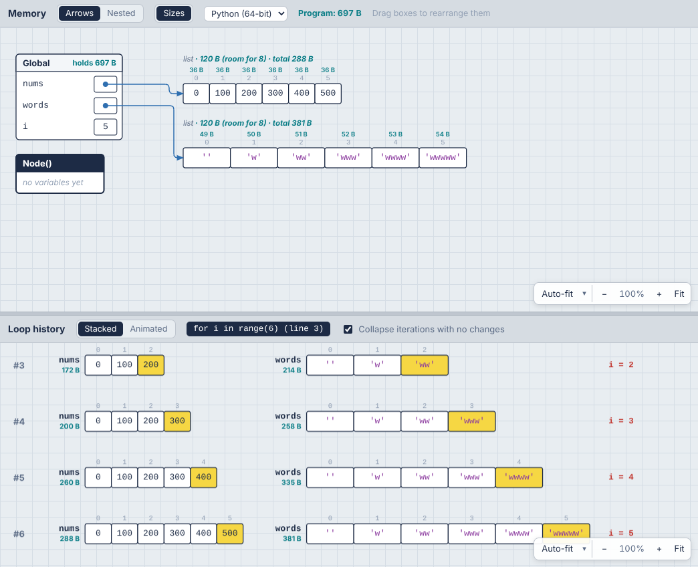

Sizes are drawn in their own color (teal by default; **Memory sizes** under Colors in the [Style panel](#styling-the-canvas)), so they never read as values:

- **The label line** of each list, dict, set or object gets the object's own size and its total: `list · 120 B (room for 8) · total 288 B`. A box with a title (dicts, objects, graphs) shows it at the right of the title bar.
- **Each cell** of a list, tuple or array gets its size, in a row above the index numbers, so you can see a Python int take 36 B (the 8-byte pointer plus the 28-byte int it points at).
- **Each frame** says how much its variables hold (`holds 697 B`).
- **The header** shows the whole program's total, everything reachable from every frame: **Program: 697 B**.
- **The loop history** shows the total of each container, linked structure or graph on every row, so you can watch it grow iteration by iteration. A Python list that's appended to jumps in steps (172 B → 200 B → 260 B …) as it reallocates.

**Own and total.** An object's own size is the object itself: its header and its slots. Its total adds everything it holds, all the way down. Anything reachable twice (two references to one node, a shared list) is counted once, so totals never double-count.

**Room for N** (Python lists only) is the list's capacity: how many items fit before it has to grow. Python over-allocates so `append` is cheap on average, and this is where you see it.

The menu next to the switch picks how sizes are counted. Each language remembers its own choice:

| Model | For | How it counts |
| --- | --- | --- |
| **Python (64-bit)** | Python (default) | What CPython really uses on a 64-bit machine, from `sys.getsizeof`. Every value is an object: an int is 28 bytes, a float 24, an ASCII string 41 + its length, and a list slot is an 8-byte pointer to the object. |
| **Textbook** | Python and JavaScript (default) | The model algorithm courses use: an 8-byte slot per element, numbers stored in the slot, one byte per character, 16 bytes (key and value) per hash map entry, 8 bytes per object field. An array of n numbers is 8n bytes. Language-neutral and easy to do in your head. Functions and classes aren't sized. |
| **Estimated (V8)** | JavaScript | An estimate of what V8 (Chrome, Node) uses on 64-bit with pointer compression: 4-byte slots, small integers stored in the slot, other numbers as 12-byte heap numbers, 12-byte object headers, `Map` and `Set` as hash tables. JavaScript can't measure objects, so these are marked `≈`. |

**Python sizes in the browser.** Pyodide is 32-bit WebAssembly, where pointers are 4 bytes, so `sys.getsizeof` there gives smaller numbers than your laptop would. The tracer converts every size to what 64-bit CPython reports, using rules measured on both (pointer-based objects double, ints gain 12 bytes, ASCII strings 20, dicts are worked out from their hash table). Lists, tuples, sets, dicts, strings and big ints come out exactly; instances and classes within a few percent.

Turning sizes on costs almost nothing: they're computed once per step and cached, and stepping is no slower in practice (about 3 ms a step either way).

### Time and space complexity

The **Time · Space** button in the toolbar shows how the program's running time and extra memory grow with its input, like **Time O(n²) · Space O(1)** for bubble sort, or **Time O(V + E) · Space O(V)** for breadth-first search. The editor labels each loop with how many times it runs, and each function with what it costs:

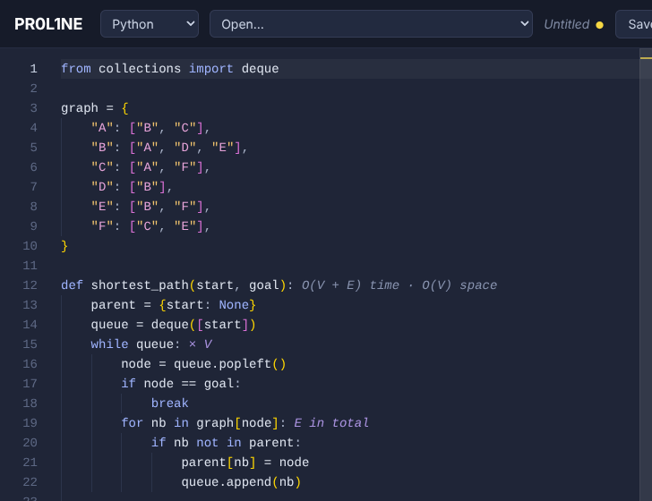

- **`× n`** after a loop: it runs n times each time it's reached. Nested loops multiply.
- **`E in total`**: an inner loop that adds up to a total over the whole outer loop instead of multiplying it, like a BFS visiting each edge once, or a sliding window whose left edge only moves forward.
- **`O(n log n) time · O(n) space`** after a function definition.

Hover a label for the reasoning. Click the button for the whole explanation:

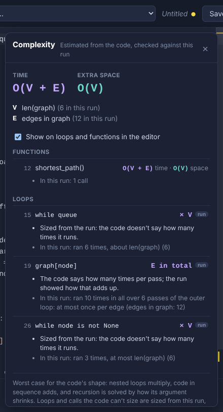

- **The sizes.** What n, m, V and E stand for in this program (`n = len(nums)`, `V = len(graph)`, `E = edges in graph`), with their values in this run. Sizes come from your own variable names: a loop over `range(len(nums))` is n, nested loops over a grid's rows and columns are n·m, a dict of neighbor lists gives V and E, and a linked structure of objects is counted in nodes.
- **Each function**: its time and space, and how they were worked out (*calls itself twice on half of n, with n work per call: n log n in all*; *remembers its answers (a memo), so it does the work once per value of n*), with the run's own counts (*25 calls in all, 6 deep at most*).
- **Each loop**: its label, whether it was sized from the code or from the run, and what the run did (*ran up to 5 times per run, expected about 5*). Click any row to jump to that line.
- **Worth knowing**: costly operations hiding inside loops, like `queue.shift()` in JavaScript (it moves every item, so a BFS that uses it is O(V²) rather than O(V + E)), `x in some_list` in Python, or copying a slice.

**How it's worked out.** First from the code's shape: nested loops multiply, code in sequence adds, `range(n)` is n, a loop that halves its range (`mid = (lo + hi) // 2`) is log n, and built-ins have their known costs (`sorted` is n log n, `in` on a list is n, on a set is 1). Recursion is solved by its pattern: one call on `n - 1` is n deep; two calls on halves with linear work is n log n; two calls on `n - 1` is 2ⁿ, unless the function keeps a memo.

**Then it's checked against the run**, which fixes what reading the code alone gets wrong:

- A loop the code doesn't bound (`while queue:`) is sized by how many times it ran, matched to the program's inputs: *ran 6 times, about len(graph) (6)*. These loops get a small **run** badge in the panel.
- An inner loop that ran about as many times in total as its outer loop is **amortized**: it adds rather than multiplies. That's how a sliding window comes out O(n) and a BFS O(V + E), not O(n²) and O(V·E).
- Recursion the code can't classify, like a flood fill or a DFS guarded by a visited set, is sized by how many calls the run made. Exponential recursion that made far fewer calls than 2ⁿ is pruned by something (a check, a cache), and is counted that way.
- Collections your code builds (a queue, a `seen` set, a result list) are sized by how big they got, in terms of the inputs.

**Space** is the extra memory beyond the input: collections the code creates and fills, copies (slices, `sorted()`, `[...arr]`), and the call stack's depth for recursion. The inputs themselves aren't counted.

It's the **worst case for the code's shape**, not the average case. An early `break` or a lucky input doesn't make a loop count for less. Turn the editor labels off with the checkbox in the panel (it's remembered).

### Loop history

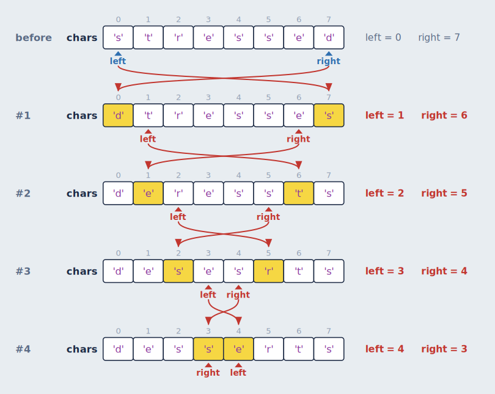

When the current step is inside a loop, the bottom section stacks the state at the end of every iteration so far, starting with a **before** row for the state when the loop was entered. Between rows:

- **Yellow cells** changed during that iteration.
- **Red arrows** connect each changed cell to its previous row. When a value moved from one index to another (a swap), the arrow starts at the index it came from, so swaps show as crossing arrows.
- **Variables to the right** (`i = 2`, `left = 3`) are the scalars that change during the loop. The ones that changed in that iteration are red.
- **The current iteration** is highlighted while the loop is still running.

If there are several active loops (nested loops, or a loop inside a function called from a loop), tabs above the history let you pick which one to show. The innermost loop is selected by default while running, and once a loop finishes its full history stays visible until the program enters another loop.

#### Stacked or animated

The **Stacked | Animated** switch in the Loop history header picks between two views of the same loop. Your choice is remembered.

- **Stacked** (the default) is the history described above: one row per iteration, so you can compare any iteration with any other.
- **Animated** shows a single row: the loop's state at the current step. As you step or [play](#playing-a-program), cells change in place and values slide between cells, so a sort visibly shuffles its values into order and a linked list's arrows turn around one by one. Cells that changed on that step are yellow. The row keeps the same layout (columns, cell widths, tree shape) as the stacked view, so nothing jumps around between steps.

Stacked is better for seeing the whole story at once, and Animated for following what a single step does.

#### Grids

A list of lists (a matrix, a game board, a dynamic programming table) is drawn as a grid in every row, with the same i/j markers as nested mode: `i` beside its row, `j` under its column, and an outline on the cell where they meet. Cells that changed in an iteration are yellow, so a dynamic programming table visibly fills in, one cell per iteration:

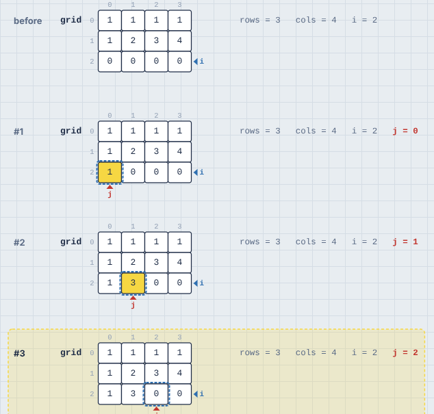

A grid doesn't show markers for one past its last column, since a name like `cols` would otherwise always sit there.

#### Linked lists and trees

Linked nodes don't have indices, so the loop history gives them some. If the loop's variables lead to objects that link to objects of the same class (a `next`, or `left` and `right`), every node gets a fixed column, the same in every row, and each row shows where the links point at that moment:

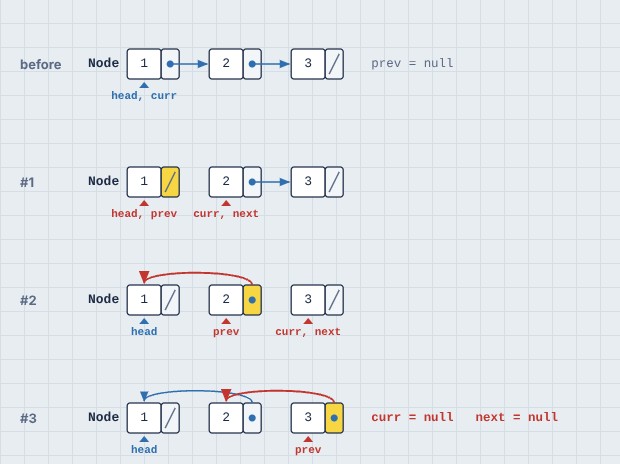

- Each node is its **value** (the first plain field, like `val` or `key`) followed by a **slot per link**. A slash in a slot means `null`/`None`.
- A link to the next column is a short straight arrow. Other links arc over the row. A second link field, like `right` in a tree, arcs underneath.
- A link that changed in that iteration is **red** and its slot is highlighted. A changed value is yellow, like a changed list cell.
- **Variables pointing at nodes** (`head`, `prev`, `curr`) are markers under the node, like `i` and `j` under a list. Inside a method, nodes reached through an object are found too, labeled `self.head` or `this.head`.
- Columns follow the links from the start of the loop, so the starting list reads left to right.

**Binary trees are drawn top-down.** If the class has exactly two links and no node ever has two incoming links, it's a tree. Each node keeps its in-order column (so a binary search tree reads sorted from left to right), and sits at a height set by its depth. Links go from the bottom of each slot down to the child:

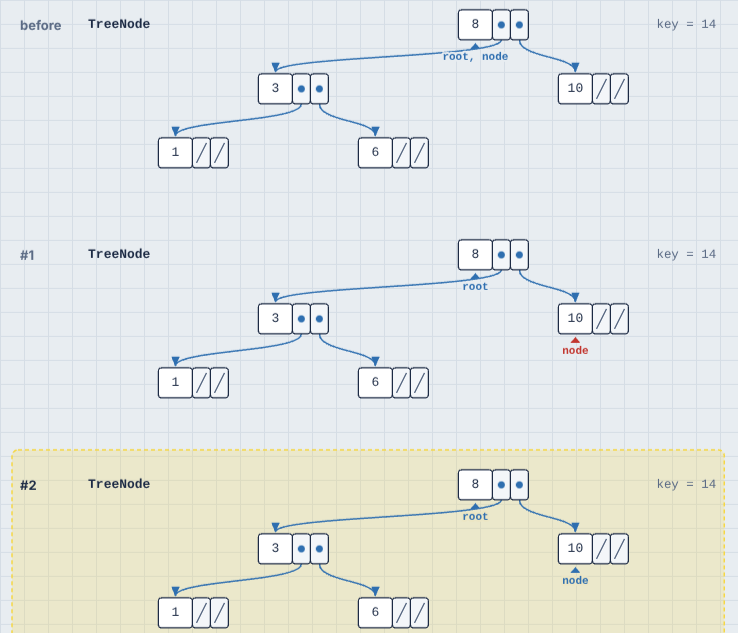

A doubly linked list also has two links (`prev` and `next`), but its nodes have two incoming links each, so it's drawn as a list.

Nodes the code can no longer reach (say, the old head after it's dropped) leave the row. Plain JavaScript objects like `{ val: 1, next: null }` count as nodes too.

**Collapse iterations with no changes** folds runs of iterations that didn't modify any container or linked node into a single "#4 to #6: nothing changed" line. This only applies to loops that modify data somewhere. In a loop that only reads (like binary search), the moving indices are the interesting part, so every row is kept:

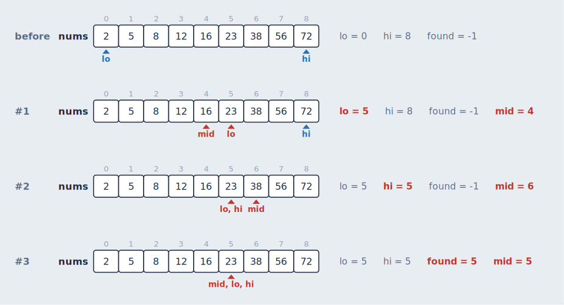

### Graphs

When your data is a graph, the memory view draws it as one: nodes and edges in a single box, laid out once for the whole run so nodes never move while you step. What's recognized:

| In your code | Recognized |
| --- | --- |
| A dict, object or `Map` of neighbor lists or sets: `{"A": ["B", "C"], ...}` | Automatically, when most neighbors are also keys (so `{"fruit": ["apple"]}` isn't mistaken for one) |
| Weighted: `{"A": {"B": 4}}`, or `{"A": [("B", 4)]}` | Automatically. Weights label the edges |
| Objects that hold lists, sets or dicts of each other: `city.roads`, `node.children` | Automatically. This covers graphs of objects, trees with any number of children, and tries (a dict's keys label its edges) |
| Neighbors by number: `adj = [[1, 2], [0], [0]]` | With a hint, `viz: graph adj`, because a grid looks the same |
| An adjacency matrix: `m = [[0, 1], [1, 0]]` | With a hint, `viz: graph m`. A square list of lists is read as a matrix |
| An edge list: `edges = [(0, 1), (1, 2, 5)]` | With a hint, `viz: graph edges`. JavaScript arrays need `viz: graph edges edgelist` |

A graph is **undirected** when every edge goes both ways, and **directed** (with arrowheads) otherwise. It's drawn in **layers** when it can be, meaning a directed graph without cycles or a tree, so a dependency graph or a trie reads from top to bottom. Anything else gets a force-directed layout.

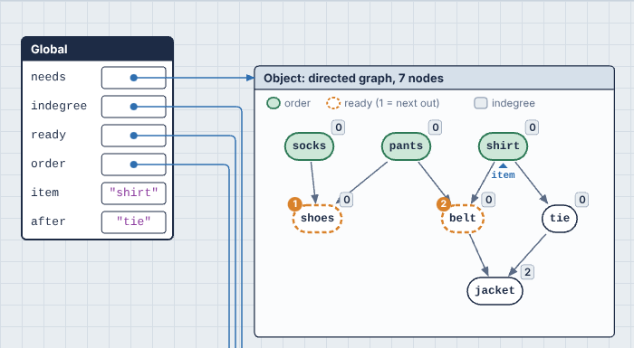

#### Your algorithm's state, drawn on the graph

The variables your algorithm uses are drawn on the graph, the way you'd mark it up on a whiteboard. Nothing has to be declared. What a variable means is read from its type, and where the type isn't enough, from its name:

| A variable that holds... | Is drawn as |
| --- | --- |
| A set of nodes (`visited`, `seen`), a dict of node → `True`, or one `True`/`False` per node | Filled-in green nodes |
| A list named like a result (`order`, `result`, `done`, `topo`...) | Filled in, like a visited set |
| Any other list, or a `deque`, of nodes | Dashed orange rings, numbered in the order they'll come out. That's the front of a queue, the top of a stack (named `stack` or `todo`), or the smallest of a heap (named `heap`, `pq` or `frontier`, or holding `(priority, node)` pairs) |
| A dict of node → number or text (`dist`, `indegree`, `color`), or one number per node | A small label beside each node |
| A dict of node → node named like a parent (`parent`, `prev`, `came_from`), or one parent per node | Green arrows: the search tree. Links that aren't edges of the graph, like a union-find forest, are dashed |
| A list of nodes named like a path (`path`, `route`, `trip`) | Purple arrows along the path |
| A list of `(a, b, ...)` edges named like `mst`, `tree` or `chosen` | Those edges in purple |
| One node (`node`, `u`, `v`, `cur`, `start`, `goal`, `nb`, `next`...), or any variable pointing at a node object | A ▲ marker with its name, under the node |

A legend at the top of the graph names the variables. Whatever changed in the last step gets a yellow halo, like a changed cell, and markers slide from node to node when [animated](#playing-a-program). A name that doesn't fit the conventions can be added with a hint: `viz: graph graph: here, there`.

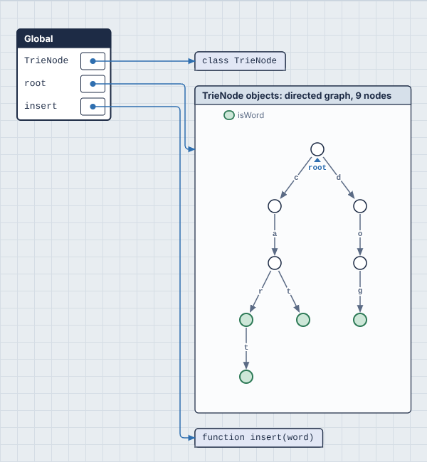

**In the loop history**, every row draws the graph with that iteration's state, so you can watch a BFS frontier spread out row by row. In animated mode, one graph changes as you step. The algorithm's other variables (`dist`, `heap`, `visited`) are still shown as rows of cells next to it. The graph's own dict isn't, since the picture already shows it.

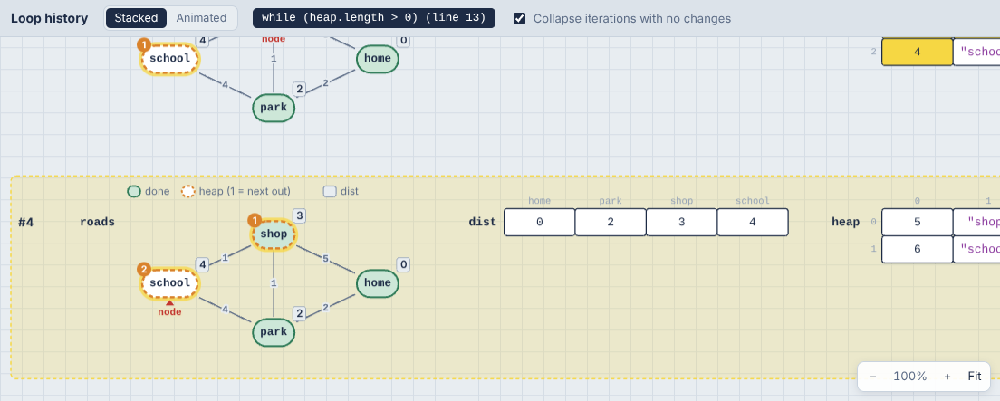

Graphs look the same in Nested mode, since a graph can't be drawn as boxes inside boxes. To see the dict behind a graph instead, add `viz: plain graph`.

### Generators and async functions

A generator or `async` function can stop partway through and carry on later, so it doesn't fit the usual call stack, where a call is pushed, runs to the end and is popped. PR0L1NE gives each one its **own frame that's suspended and resumed** instead:

1. Calling `next()` (or `for ... of`) on a generator, or calling an `async` function, pushes its frame like any call.
2. At a `yield`, the step reads **fibonacci() yields 2 and pauses**, and the frame shows the value in a `yields` row. At an `await`, the step reads **f() waits at line N and pauses**.
3. The frame then leaves the call stack and is drawn below it, dashed, titled **fibonacci(), paused at line 4**. Its variables are still there, and still connected by arrows, because they're still alive.
4. When the generator is asked for its next value, or the awaited promise settles, the same frame moves back onto the stack (**f() resumes at line N**), at the same position and with the same variables, and carries on.

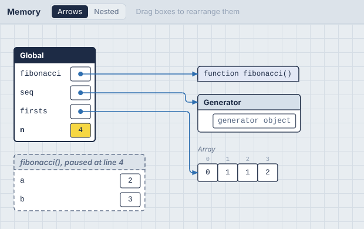

A paused frame stays on the canvas until its generator finishes or is thrown away. A loop inside a generator keeps its iteration count while it's paused, so the loop history keeps working across `yield`s.

**JavaScript's event loop** runs too. After your script ends, pending `await`s continue, and `setTimeout` and `setInterval` callbacks run, in the order their timers would fire. Timers run on a **virtual clock**: a `setTimeout(f, 5000)` runs immediately rather than after five seconds, but always after timers due sooner, so the program behaves as it would for real without making you wait. The **Program finished** step comes after the last callback. A promise rejection that nothing handles stops the run with an error, as it would in Node. `for await` loops work, and so do `async` generators.

**Python** follows the same rules for generators, generator expressions and `asyncio` coroutines (`asyncio.run`, `await`, `asyncio.gather`, `asyncio.sleep`). A generator object in the heap says where it's paused, like `fibonacci() paused at line 4`. `asyncio` gets a **virtual clock** too: `asyncio.sleep(2)` costs no real time, but tasks still wake in the order their sleeps end. That works the same in the browser and on your machine (see [how](#asyncio-on-a-virtual-clock)).

The examples include "Generator (Fibonacci)" in all three languages, "Async tasks (asyncio)" for Python, and "Async tasks and timers" for JavaScript and TypeScript.

---

## Hints: `viz:` comments

PR0L1NE chooses what to draw automatically, but sometimes its guesses aren't what you want: a helper variable clutters the loop history, `cur` isn't recognized as a position in a list, a tree with parent pointers comes out as a list, or a list of lists is really a graph. A **hint** is a comment that tells it what you meant.

The quickest way to learn them is the **Hints, step by step** group in the Open… menu: [ten examples](#learning-hints-with-the-examples), from one hint to all of them together.

```python
# viz: hide temp
# viz: pointers nums: first, last
def rotate(nums):
    first, last = 0, len(nums) - 1
    while first < last:
        temp = nums[first]
        nums[first] = nums[last]
        nums[last] = temp
        first += 1
        last -= 1
```

A hint is a comment whose text starts with `viz:`:

| Language | Hint comments |
| --- | --- |
| Python | `# viz: ...` |
| JavaScript and TypeScript | `// viz: ...` or `/* viz: ... */` |

- **It can go anywhere**: on a line of its own, at the end of a line of code, at the top of the file. Hints apply to the **whole program**, not just the code near them, so a common style is to put them at the top. A hint in a string (`"# viz: hide x"`) isn't a comment, so it's ignored.
- **One hint per comment.** Write several comments for several hints.
- **Keywords aren't case sensitive**, and spacing is flexible: `# VIZ:  Hide a ,b` works.

### The hints

| Hint | What it does |
| --- | --- |
| `viz: hide temp, scratch` | Never draws these variables, in any frame, in the memory view or the loop history. Objects only they point at disappear too. Useful for helper variables, or `self`/`this` when it's noise. |
| `viz: show total, seen` | Always includes these variables in the loop history, even when PR0L1NE would leave them out because they don't change during the loop. |
| `viz: pointers nums: lo, hi` | Draws `lo` and `hi` as [pointer markers](#pointer-detection) under `nums` whenever they hold a whole number, for names the code never writes as `nums[lo]`. |
| `viz: pointers grid[]: col` | The same, for a **grid**'s columns: `col` is marked under a column of `grid`. (Use `pointers grid: row` for its rows.) |
| `viz: tree Node(left, right)` | Draws objects of class `Node` as a binary tree, using `left` and `right` as the children, in both the memory view and the loop history. Other fields, like `parent`, are drawn as plain fields. |
| `viz: list Node(next)` | Draws objects of class `Node` as a linked list in the loop history, using `next` as the link. Other fields, like `prev` or `random`, aren't drawn as links. |
| `viz: graph adj` | Draws `adj` as a [graph](#graphs): a dict, a list of neighbor lists, an adjacency matrix or an edge list. `self.adj` or `this.adj` work too, or just the field name. |
| `viz: graph adj: seen, todo, here` | The same, and also draws these variables on the graph, whatever they're called. Each is drawn by its type: a set fills nodes in, a list numbers them, a dict of numbers labels them, a variable holding a node gets a ▲ marker. |
| `viz: graph Node(neighbors)` | Draws objects of class `Node` as a graph, with `neighbors` as the edges. It can be a list, a set, a dict (its keys label the edges) or a direct link. List several fields to use them all. |
| `viz: plain graph` | Never draws `graph` as a graph, even though it looks like one. It's drawn as an ordinary dict or list instead. Takes variable or class names. |

Names are the variable or field names as written in your code. Class names in `tree`, `list` and `graph` are what the canvas shows as the box title (a Python class name, or a JavaScript constructor name). If two hints name the same class or variable, the later one wins.

#### Graph options

Words between a graph hint's target and its colon change how the graph is read or drawn. Any number of them can be combined:

| Option | Effect |
| --- | --- |
| `directed`, `undirected` | Draw arrowheads, or don't. Without either, a graph is undirected when every edge goes both ways. |
| `matrix` | Read a list of lists as an adjacency matrix: `m[i][j]` is the edge from `i` to `j`. `0`, `False`, `None`, `-1` and infinity mean no edge. Other numbers are weights, and are shown unless every edge is `1` or `True`. |
| `edgelist` | Read a list of `(a, b)` or `(a, b, weight)` as edges. Python tuples are read this way without the option. |
| `layered`, `force`, `circle` | Lay it out in layers from top to bottom, force-directed, or in a ring. Without one, it's layered when that's possible, and force-directed otherwise. |

```python
# viz: graph flights matrix directed circle: reach, city
```

### When a hint is wrong

A hint that PR0L1NE can't understand doesn't stop your program. It's ignored, and you're told why in two places: a yellow banner at the top of the canvas (`Hint on line 3: Unknown hint "colour blue". Hints are: hide, show, pointers, tree, list, graph, plain.`) and a yellow squiggle under the comment in the editor, which you can hover. Each message shows the form the hint should take, such as `viz: tree Node(left, right)`.

A hint that's well-formed but names something that doesn't exist (`hide nmus`) does nothing, since it may refer to a variable that only exists in some runs.

### Learning hints with the examples

The **Hints, step by step** group has the same ten examples in every language. Each starts with its hints and a comment explaining what they change. Deleting a hint line and watching the canvas change is a good way to see what it does.

| Example | Hints | What it shows |
| --- | --- | --- |
| 1 · hide | `hide before, receipt` | A running total, without the helper variables cluttering the loop history |
| 2 · show | `show target` | A linear search that keeps the value it's looking for in every row, though it never changes |
| 3 · pointers | `pointers nums: read` | Removing duplicates in place: `read` comes from `enumerate()`, so only the hint can mark it |
| 4 · grid pointers | `pointers grid: r`, `pointers grid[]: c` | Column sums: marking a grid's row and column when the code walks rows with `for row in grid` |
| 5 · tree | `tree Node(left, right)` | A binary search tree with parent links, drawn top-down instead of as a list |
| 6 · list | `list Item(next)` | A list whose items also have `random` links, followed along `next` only |
| 7 · graph | `graph adj` | A depth-first search over neighbor lists by number, with `seen`, `stack`, `u` and `v` drawn on it |
| 8 · graph options | `graph flights matrix directed circle: reach, frontier, city, nxt` | An adjacency matrix, read as a directed graph and drawn in a ring |
| 9 · edge list | `graph edges edgelist undirected: parent, mst, a, b` | Kruskal's algorithm: the union-find forest in green and the chosen edges in purple |
| 10 · all together | `graph`, `plain`, `hide` and `show` | Dijkstra on a road map with a closed road: costs, the frontier, the tree of best routes and the final route all on the graph |

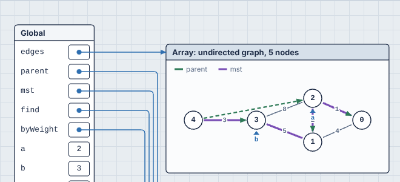

---

## How it works

### The big picture

```
┌──────────── main thread ─────────────┐        ┌────────── Web Worker ──────────┐
│                                       │        │                                │
│  editor.ts ──code──▶ runner.ts ───────┼─run───▶│  pyodide.worker.ts   (Python)  │
│  (Monaco)            (watchdog,       │        │    └─ Pyodide (CPython/WASM)   │
│                       one per         │        │         └─ tracer.py           │
│                       language)       │        │            sys.settrace + ast  │
│                      ◀────────────────┼─trace──┤                                │
│                                       │  JSON  │  javascript.worker.ts  (JS)    │
│  main.ts holds { trace, stepIndex }   │        │    ├─ instrument.ts  (Babel)   │
│                                       │        │    └─ runtime.ts  (recorder)   │
│                                       │        │                                │
│                                       │        │  typescript.worker.ts  (TS)    │
│                                       │        │    ├─ typescript.ts  (strip)   │
│                                       │        │    └─ then same as JS          │
│                                       │        └────────────────────────────────┘
│     │                                 │
│     ├─ trace/hints.ts        parse and apply viz: comments
│     ├─ trace/diff.ts         what changed between step N-1 and N
│     ├─ trace/loopHistory.ts  which steps are which loop iteration
│     ├─ render/memory.ts      snapshot ─▶ SVG (frames, heap, arrows)
│     ├─ render/loopView.ts    loop rows ─▶ SVG (stacked or live row)
│     └─ render/animate.ts     tween old drawing ─▶ new drawing
└───────────────────────────────────────┘
```

The design rule that holds this together: **each layer only talks to the next through data.** The tracers know nothing about drawing. The renderer knows nothing about Python or JavaScript. The contract between them is the trace format in [`src/trace/types.ts`](src/trace/types.ts). That's why adding JavaScript didn't require any new rendering code, only two small tweaks (JavaScript's primitive type names, and `function` instead of `def` in function titles), and why TypeScript needed none at all.

### 1. Running code without freezing the page

User code runs in a **Web Worker**, a separate thread, so even a `while True:` can't lock up the editor.

There's one worker per language, and both speak the same small protocol, defined in [`protocol.ts`](src/worker/protocol.ts): the page sends `run` with the source code, and the worker answers with `ready`, then a `result` holding a trace.

- [`pyodide.worker.ts`](src/worker/pyodide.worker.ts) imports Pyodide from jsDelivr, loads the tracer's Python source into it (Vite bundles `tracer.py` as a string through its `?raw` import), and then answers runs.
- [`javascript.worker.ts`](src/js/javascript.worker.ts) and [`typescript.worker.ts`](src/js/typescript.worker.ts) are one-line entry points into [`serve.ts`](src/js/serve.ts), which handles the protocol. They're ready immediately, and call `traceJavaScript()` or `traceTypeScript()` for each run. Keeping them as separate workers means only the TypeScript one contains Babel's core.

[`languages.ts`](src/languages.ts) lists each language's worker, Monaco language mode and examples, so everything language-specific in the UI comes from one place.

[`runner.ts`](src/worker/runner.ts) is the main-thread side. There's one runner per language, created the first time that language is used, so someone writing JavaScript never downloads Python. It keeps one run in flight at a time, and `main.ts` drops intermediate edits so only the newest code runs after the current run finishes. It also has a **watchdog**: if a run takes longer than 10 seconds, it terminates the worker and starts a fresh one. (The tracer's own step budget, below, catches almost every runaway loop first. The watchdog is the fallback for code stuck inside a single long C call, like `sum(range(10**12))`, which never produces a trace event.)

### 2. Tracing Python with `sys.settrace`

[`tracer.py`](src/worker/tracer.py) is plain CPython, and the core trick fits in a few lines. Python lets you install a function that the interpreter calls on every event:

```python
sys.settrace(self.trace)
exec(compile(source, "<user>", "exec"), user_globals)
```

The interpreter then calls `trace(frame, event, arg)` for each:

- `call`: a function (or the module itself) starts,
- `line`: a line is about to run,
- `return`: a function is about to return (`arg` is the return value),
- `exception`: an exception is raised in this frame.

The `frame` object is a live view of the running program. `frame.f_locals` holds the variables, `frame.f_back` points to the caller, and `frame.f_lineno` is the current line. The tracer only cares about frames whose filename is `"<user>"` (the name we compiled the code under), so library internals are skipped.

At each event, `record()` walks the stack from the current frame outward, serializes every frame's variables, and appends a **step** to the trace.

**Serialization** ([`Serializer`](src/worker/tracer.py)) turns Python values into two kinds of trace value:

- primitives (`int`, `float`, `str`, `bool`, `None`, ...) become `{"kind": "prim", "type": "int", "repr": "42"}`,
- everything else becomes a reference `{"kind": "ref", "id": "o140..."}`, and the object itself goes into the step's `heap` dictionary, recursively.

**Stable identity** is what makes "this is the same list as one step ago" possible, which every highlight and arrow depends on. The tracer numbers objects in the order it first sees them (`o1`, `o2`, ...), using Python's `id()` to recognize an object it has seen before. That makes ids the same on every run of the same program, which is how a box you've [dragged](#rearranging-the-memory-view) keeps its place through live re-runs. `id()` is only unique while an object is alive, and CPython can reuse it after an object is garbage collected. To prevent two objects sharing an id, the tracer keeps a reference to every object it has seen (`keepalive`) until the run ends.

**Safety rails:**

- **Step budget.** After `maxSteps` events (3,000 by default, set in `main.ts`), the trace function raises `StepLimitExceeded`. It subclasses `BaseException` rather than `Exception`, so user code with `except Exception:` can't swallow it.
- **Size caps.** Containers show at most 60 items and primitives at most 48 characters, so a 10,000-element list doesn't produce a huge trace.
- **Output capture.** `sys.stdout` is swapped for a `StringIO` during the run. Each step records how many characters had been printed so far, so the output panel shows exactly what was printed up to the step you're on.
- **No `input()`.** There's no keyboard in a worker, so `input()` raises an error asking you to hard-code test data.

### 3. Static analysis of Python with `ast`

Before running anything, `analyze()` parses the code with Python's own `ast` module to learn two things the runtime trace can't tell us.

**Where the loops are.** For each `for` and `while`, it records the header line and the body's line range. Each loop gets an id from its header line (`L4`).

**Which names index which containers.** Every `Subscript` node whose target is a plain name is recorded, along with the names used inside the brackets. So `arr[j + 1]` produces `{"arr": ["j"]}`. One level of nesting is recorded too, under the name plus `[]`: `grid[i][j]` produces `{"grid": ["i"], "grid[]": ["j"]}`, which is how a grid knows `i` picks a row and `j` a column. The JavaScript instrumenter records the same thing from `MemberExpression`s. This drives [pointer detection](#pointer-detection).

### 4. Detecting loop iterations in Python

`sys.settrace` reports lines, not iterations, so iterations are inferred from line transitions inside each frame (see `update_loops`):

- **Loop entered**: execution reaches a loop's header line while the loop isn't active in this frame. A new *instance* starts at iteration 0.
- **New iteration**: execution moves *from the header line into the body*. The iteration counter goes up by one.
- **Loop exited**: execution reaches a line that's neither the header nor inside the body. The instance ends.

Counting header-to-body transitions, rather than header visits, matters because Python re-checks the header one last time before the loop ends. That final check doesn't start an iteration, so it shouldn't be counted as one. It also handles `continue` (back to the header, then into the body: a new iteration) and `break` (straight out: loop exits) without special cases.

**Instances** matter for nested loops. The inner loop of bubble sort is entered once per outer iteration, and each entry is a separate instance with its own iteration count. State is tracked per frame, so recursion (the same loop running in several frames at once) works too.

Every step stores the active loops for all frames on the stack, as `{frame, loop, instance, iteration}`. That means when a loop calls a function, steps inside the function still know which iteration of the caller's loop they belong to. Loops in suspended frames are included too, so a loop inside a generator keeps its place while the generator is paused.

#### Generators and coroutines in Python

`sys.settrace` doesn't announce "yield" or "resume", but they can be recognized from the events it does send:

- **A yield or await looks like a return.** When a generator yields, the interpreter sends a `return` event for its frame. The difference is visible in the bytecode: after a yield, the frame is parked on the yield itself (`YIELD_VALUE` in Python 3.12, which the browser runs) or on the `RESUME` after it (3.13), so `co_code[f_lasti]` is one of those. A real return isn't. Whether the frame is a generator or a coroutine (`co_flags`) decides whether the step is called `yield` or `await`.
- **A resume looks like a call.** When a paused frame continues, the interpreter sends a `call` event for that same frame object. The tracer keeps paused frames in a dictionary by frame id, so a `call` for a frame it already knows is a resume.
- **Exceptions need care.** Closing a generator (`gen.close()`, or the generator being garbage collected) raises `GeneratorExit` at the `yield`, which can also end with `RESUME` next. The tracer remembers frames an exception is passing through (`unwinding`), so their next `return` is a real exit, not a yield. Await's internal `StopIteration` plumbing isn't shown as an exception step.

`record()` then draws paused frames below the stack with `state: "suspended"`. It walks the whole stack and skips library frames rather than stopping at the first one, since under `asyncio` your coroutines are called from the event loop's code. Generator objects get a description of where they're paused, and the tracer doesn't keep generator objects alive the way it keeps other objects (see [stable identity](#2-tracing-python-with-syssettrace)); a `weakref.finalize` forgets a generator's id when it's collected. Otherwise holding on to it would stop a dropped generator from ever being closed.

### 5. Tracing JavaScript

JavaScript has no equivalent of `sys.settrace` inside a web page. Real debugging hooks only exist in Node or browser extensions. So instead, PR0L1NE **rewrites your program to report on itself**: [`instrument.ts`](src/js/instrument.ts) parses the code with Babel, inserts calls to a recorder, and the rewritten program runs in the worker. The recorder, [`runtime.ts`](src/js/runtime.ts), builds steps in exactly the format `tracer.py` produces.

Here's a small example, as printed by `npm run instrument`:

```js
// Your code
let total = 0;
for (const x of [5, 6]) {
  total += x;
}
```

```js
// What actually runs
const __av_f = __av.enter("Global", 0, () => [["total", () => total]]);
try {
  __av.line(__av_f, 1, () => [["total", () => total]]);
  let total = 0;
  {
    __av.loopEnter(__av_f, "L2", 2, () => [["total", () => total]]);
    try {
      for (const x of [5, 6]) {
        __av.loopIter(__av_f, "L2");
        __av.line(__av_f, 3, () => [["total", () => total], ["x", () => x]]);
        total += x;
        __av.tail(__av_f, "L2", 2, () => [["total", () => total], ["x", () => x]]);
      }
    } finally {
      __av.loopExit(__av_f, "L2");
    }
  }
  __av.mainDone(__av_f, () => [["total", () => total]]);
} catch (__av_e) {
  __av.raise(__av_f, __av_e);
  throw __av_e;
}
```

`__av` is the runtime, passed in with `new Function("__av", "console", "setTimeout", ..., code)` along with a `console` and [virtual timers](#generators-and-async-in-javascript). Names starting with `__av` are reserved and hidden from the canvas. Every event names the frame it belongs to (`__av_f`), which is what lets a generator's events find their way back to its frame after it resumes. The `Global` frame isn't popped when the script ends (`mainDone`), because callbacks and `await`s may still run; the tracer pops it after the event loop is empty.

**Reading variables.** Python hands the tracer `frame.f_locals`. JavaScript has nothing like it, so the instrumenter works out which variables are visible at each statement using Babel's scope analysis, and passes a **getter**: a list of `[name, () => value]` pairs. The runtime calls these thunks when it takes a snapshot, so it always reads live values. Each thunk is called inside its own `try`, because reading a `let` or `const` before its declaration throws (the "temporal dead zone"). A variable that throws is simply left out of that snapshot. That's why block-scoped variables appear exactly when they're declared.

**The call stack.** There's no stack to inspect either, so the runtime keeps a **shadow stack**. Every instrumented function starts with `__av.enter(name, line, getter)` and ends with `__av.exit()` in a `finally`, which pops the frame however the function finishes. Each frame remembers its most recent getter, so when a callee is running, the caller's variables can still be read. `return x` becomes `return __av.ret(x)` to record the return value, and a final `__av.ret(void 0)` records falling off the end. The `catch` clause records an exception step in each frame the error passes through.

Class methods, object methods and constructors also get `this` in their getters. Calling `this` in a derived constructor before `super()` throws, which the per-thunk `try` handles like any other unreadable variable.

**Loops are reported explicitly**, which is simpler than Python's approach of inferring iterations from line numbers. `loopEnter` starts a new instance and records the "before" snapshot. `loopIter` starts each iteration. `tail` records the end-of-iteration snapshot, the equivalent of Python re-checking the loop header. `loopExit` runs in a `finally`. A `continue` also records a `tail` before jumping, including a labeled `continue outer` aimed at an enclosing loop. `break`, `return` and exceptions don't, which matches what the Python tracer sees. Bubble sort produces 41 steps in both languages.

**Closures.** Python exposes captured variables through `fn.__closure__`, but JavaScript functions are opaque. For each function, the instrumenter uses Babel's binding information to find variables it uses from enclosing functions. It then registers them with the runtime: function expressions and arrows are wrapped as `__av.fn(fn, name, getter)`, and function declarations are registered at the top of their block, since they're hoisted. When the heap view draws a function, it reads those captured values through the getter.

**Serialization** follows the same rules as Python, adapted to JavaScript's types. Arrays and typed arrays become lists, `Map` and plain objects become dicts, `Set` becomes a set, and class instances become objects named after their constructor. Functions record their parameter names (parsed from their source) and any captured variables. `Date`, `RegExp`, `Error` and `Promise` are drawn as single values. Object ids come from a `WeakMap`, since JavaScript has no `id()`.

Snapshots never run your code. Properties are read through `Object.getOwnPropertyDescriptor`, so a getter shows as `(getter)` instead of being called. The runtime also refuses to record while it's serializing, in case anything does slip through.

**Safety rails** mirror the Python ones:

- **Step budget.** After the budget, every event throws a `StepLimit` sentinel. User code can catch the first one, but the first statement inside any `catch` block is itself an event and throws again, so the program can never make progress past the limit.
- **Call depth.** More than 250 nested calls throws a `RangeError` explaining that a recursive function may be missing its base case, rather than overflowing the real stack.
- **`console`.** The program receives its own `console` whose `log`, `info`, `warn`, `error` and `debug` print into the trace's output, formatted roughly the way Node and browsers do (`[ 1, 'b' ]`, `Map(1) { 1 => 2 }`, `Node { val: 1 }`).
- **Watchdog.** Code stuck where no event fires, like an infinite loop inside an untraced generator, is stopped by the runner's 10-second watchdog, just like Python.

**How the instrumenter is structured.** It runs three passes:

1. **Normalize.** Single-statement bodies become blocks (`if (x) y()` becomes `if (x) { y() }`), and arrow functions with expression bodies get a block with a `return`. Afterward, every statement lives in a list that calls can be inserted into.
2. **Analyze.** One Babel traversal, with scope information, records what each statement can see, each function's name, parameters and captured variables, each loop's id and header, the target of every `continue`, and which names index which arrays (for [pointer detection](#pointer-detection)). Nothing is modified in this pass, so the scope information stays accurate.
3. **Transform.** A plain post-order walk inserts the calls, mutating nodes directly. Because it never asks Babel to re-visit replaced nodes, nothing gets instrumented twice.

#### Generators and async in JavaScript

A shadow stack assumes a call ends before its caller carries on. Generators and `async` functions break that: they stop at a `yield` or `await`, their caller keeps running, and they continue later, from some other place in the program. So the runtime keeps a second collection beside the stack, **suspended frames**, and the instrumenter marks every point where a function can stop:

```js
// yield x                      becomes
__av.resumed(__av_f, yield __av.yielding(__av_f, x))

// await p                      becomes
__av.resumed(__av_f, await __av.awaiting(__av_f, p))
```

- `yielding` records the **yield** step (with the value) and `awaiting` the **await** step. Both then move the frame from the stack to the suspended set. `yield*` uses `delegating`, which hands over without a value.
- `resumed` runs when execution comes back. It records the **resume** step and puts the frame back on top of the stack. It passes through whatever the `yield` or `await` produced, so the program's behavior is unchanged.
- Because every event names its frame, an event from a frame that isn't on top of the stack can't be misattributed. If a suspended frame reports an event (which happens when a generator is resumed by `next()` and its first event is the line after the `yield`), the runtime resumes it first.
- `for await (x of source)` wraps `source` in `__av.asyncIter()`, so the hidden `await` on each iteration suspends and resumes the frame like a written one.
- A frame leaves the suspended set when its function returns or throws, the same `exit` that pops ordinary frames.

**The event loop.** `traceProgram()` is async. After the script's top level finishes, it repeatedly yields to the real event loop with a `MessageChannel` message (a macrotask, so every pending promise callback, and thus every `await` continuation, runs first), then runs the next due timer. `setTimeout`, `setInterval`, `clearTimeout` and `clearInterval` passed to the program are the runtime's own: they put callbacks in a list ordered by due time and insertion order, and `nextTimer()` advances a virtual clock to the earliest. A run ends when no timers are left, after 10,000 turns (a `setInterval` that's never cleared), when the step budget runs out, or when an error escapes. Unhandled promise rejections are caught by listening for Node's `unhandledRejection` or the browser's `unhandledrejection` event during the run.

Generator objects are drawn as a box labeled "generator object". JavaScript doesn't expose a generator's state, so unlike Python's, it can't say where it's paused; the suspended frame shows that instead.

### 6. Tracing TypeScript

Types don't exist at runtime, so tracing TypeScript means tracing the JavaScript it compiles to. [`typescript.ts`](src/js/typescript.ts) adds one step in front of the JavaScript instrumenter:

1. **Parse with types.** The same `parseProgram()` as JavaScript, with Babel's `typescript` parser plugin.
2. **Strip the types** with Babel's official TypeScript transform, [`@babel/plugin-transform-typescript`](https://babeljs.io/docs/babel-plugin-transform-typescript), run through `@babel/core`'s `transformFromAstSync`. Using the official transform rather than hand-written stripping means every TypeScript construct is handled the way the TypeScript team intends.
3. **Instrument and run** exactly as JavaScript, with `instrumentAst()`.

The key detail is line numbers. The transform works on the parsed tree rather than on text, so every statement you wrote keeps its original source location, and removing an `interface` on lines 1–3 doesn't shift anything below it.

**Generated code.** A few TypeScript constructs compile to new code rather than disappearing:

| You write | It becomes |
| --- | --- |
| `enum Light { Red, Green }` | `var Light = function (Light) { ... }(Light \|\| {})` |
| `namespace Geo { export const k = 1 }` | `let Geo;` plus a function that fills it in |
| `constructor(public x: number) {}` | `constructor(x) { this.x = x; }` |

Generated nodes have no source location, and the instrumenter treats that as "run this, but don't trace it". Generated statements get no step of their own, and generated functions run without a frame, so the enum helper never appears as a mysterious `anonymous()` call. The one thing `stripTypes()` adds back is the line of each enum and namespace declaration, matched by name, so declaring an enum still shows up as a step on its line.

**Running Babel's core in a browser.** `@babel/core` is mostly browser-ready (it ships browser versions of its config and file loaders), but it still calls Node's `path.resolve()` while setting up options. Vite replaces Node built-ins with empty stubs in browser builds, so `vite.config.ts` aliases `path` to [`path-browserify`](https://www.npmjs.com/package/path-browserify), and `stripTypes()` passes `cwd` and `envName` explicitly so Babel never reads `process.cwd()` or `process.env`. Babel's core adds about 300 kB, and only to the TypeScript worker.

### 7. The trace format

A trace looks like this (trimmed):

```json
{
  "version": 1,
  "language": "python",
  "loops": [{ "id": "L4", "kind": "for", "line": 4, "bodyStart": 5, "bodyEnd": 7, "header": "for j in range(n - i - 1)" }],
  "indexNames": { "arr": ["j"] },
  "steps": [
    {
      "event": "line",
      "line": 6,
      "stack": [{ "id": "f1", "func": "Global", "line": 6, "locals": [["arr", { "kind": "ref", "id": "o1407" }], ["j", { "kind": "prim", "type": "int", "repr": "0" }]] }],
      "heap": { "o1407": { "kind": "list", "id": "o1407", "typeName": "list", "items": [{ "kind": "prim", "type": "int", "repr": "5" }], "length": 1 } },
      "stdoutLength": 0,
      "loops": [{ "frame": "f1", "loop": "L4", "instance": 1, "iteration": 1 }]
    }
  ],
  "stdout": "",
  "error": null,
  "truncated": false
}
```

Each step is a complete snapshot, which keeps the renderer simple: any step can be drawn on its own, so scrubbing backward is free. The cost is memory, which is fine at algorithm-sized programs and the 3,000-step budget. To see the full trace for any program, run `npm run trace -- my_program.py` or `npm run trace:js -- my_program.js`.

A few optional fields cover the newer features:

- `event` can also be `"yield"`, `"await"` or `"resume"`. A yield step carries the yielded value in `returnValue`.
- `suspended` on a step lists paused frames, in the same shape as `stack` but with `"state": "suspended"`. `liveFrames(step)` in `types.ts` gives the stack plus the suspended frames, which is what anything that looks up a frame by id should use.
- `hints` on the trace lists the raw hint comments, as `{ "line": 3, "text": "hide temp" }`. The tracers only collect them. `applyHints()` adds the parsed result as `viz` before anything is drawn.

### 8. Diffing snapshots

[`trace/diff.ts`](src/trace/diff.ts) compares step N-1 with step N. The key idea is that **every object is treated as a set of named slots**: a list's slots are its indices, a dict's slots are its keys, and an object's slots are its field names. Comparing slot by slot (by value for primitives, by id for references) gives:

- `changedLocals`: variables whose value or pointer changed,
- `changedSlots`: per object, which indices/keys/fields changed,
- `newObjects` and `newFrames`: things that didn't exist a step ago.

The renderers turn these into yellow cells, bold labels, and dashed outlines.

### 9. Drawing the memory view

[`render/memory.ts`](src/render/memory.ts) works in three passes:

1. **Assign columns.** A breadth-first walk starts from the frames' variables. Objects pointed at directly by a variable get column 0, objects they point at get column 1, and so on. BFS guarantees every object is assigned a column before its children.
2. **Measure.** Each object becomes a `Shape` that knows its width, its height, and where incoming arrows should land. All text inside cells uses a monospace font, where each character is exactly 0.6em wide, so sizes are pure arithmetic with no DOM measuring. Each column is as wide as its widest shape.
3. **Place and draw.** Frames go down the left side. Then objects are placed in BFS order. Each object tries to line up vertically with the first arrow pointing at it, but never overlaps the object above it in the same column. This simple rule is what makes linked lists come out as straight horizontal chains.

**Nested mode.** Anything that holds a value (a table row, a list cell) asks for a `View` of it. A plain value or a reference dot is a fixed-size cell. In nested mode, a reference to an object that should nest is the object's whole `Shape`, and rows and cells grow to fit it. Shapes are built recursively, so a nested object's own references nest or become arrows in turn.

Which objects nest is decided first, by `chooseNested()`, a pure function with its own tests. It counts every reference to each object in the snapshot (from variables, fields, items and the return value), then walks out from the variables, nesting an object only if its count is exactly 1, it hasn't been placed yet, and it's no more than 6 levels deep. It then walks out from every object that stayed separate, so things inside a shared object can still nest inside it. Dict keys never nest, since they're labels.

The column walk then runs over separate boxes only. A reference from inside a nested object counts as coming from the box it's drawn in, so arrows still lead out of nested boxes to the right column.

Each frame and object is drawn in its own `<g class="node">` carrying a key (`frame:2:factorial`, `obj:o4`) and its position. `renderMemory()` takes a `MemoryLayout`, a map from key to position for boxes the person has dragged. A dragged box is drawn at its saved position and leaves the automatic flow, so it doesn't push later boxes down. Arrows are routed using wherever boxes actually ended up, so they follow automatically. Each node group starts with an invisible rectangle covering the whole box, so a press anywhere on it, even in the gap between a list's index numbers and its cells, grabs the box rather than panning the canvas.

**Placement never overlaps.** Boxes the person dragged are placed first, at their saved positions. Every automatically placed box then asks `findFreeY()` (in [`route.ts`](src/render/route.ts)) for the first spot at or below where it wants to go that doesn't touch anything already placed, so it moves down past dragged boxes instead of hiding underneath them. A list whose arrows leave downward reserves room under itself for their turns, so the next box down doesn't sit on them.

**Arrow routing** happens after every box is placed, in `routeEdges()`, which is pure geometry with its own tests. Each arrow is classified by where its target is: to the right (*forward*), in the same column (*u-turn*), or in an earlier column (*corridor*). Then:

1. Arrows arriving at the same side of the same box are spread a few pixels apart, ordered by where they come from. An arrow already level with its target stays level and becomes a single straight line.
2. Each vertical segment gets a **lane** in its gap. Forward arrows use lanes just left of the target's column, counted leftward. U-turns and corridors use lanes just right of a column, with shorter loops nearer the column so loops nest instead of crossing. Forward lanes are ordered with a pairwise crossing count: lane A left of lane B costs a crossing when A's exit passes B's vertical span, or B's entry passes A's.
3. Corridors run above the boxes in their horizontal range when there's room (the diagram keeps 40 px free at the top for this), otherwise below.
4. `roundedPath()` turns each list of points into an SVG path with rounded corners.

The automatic layout makes routing reliable: an object's column is its distance from the stack, so a forward arrow always goes to the very next column, and its horizontal runs only cross empty gap. [`layout.test.ts`](src/render/layout.test.ts) checks this for real: it renders every example in every language at every step, in both modes, and fails if any two boxes overlap or any arrow passes through a box it doesn't start or end at.

**Hover focus** is `applyFocus()`: each arrow carries `data-from` and `data-to` node keys, so highlighting a box's connections is a class toggle, re-applied after every render.

**Grids** in nested mode come from `gridRows()`: a list whose items are all lists nested inside it is drawn by `gridShape()` instead of as a row of cells. Its row and column markers use `ctx.pointersFor(id, level)`, where level 1 looks up the `grid[]` index names.

**Trees** are laid out as blocks. `findTreeBlocks()` runs the loop history's tree detection (`findLinkedTrack()` and `treeDepths()`, so hints apply) on the current step, treating every live frame's variables as one row. Each root with at least one child becomes a `TreeBlock`: its nodes in in-order, each with a depth. `measureBlock()` gives every slot the width of the widest node and every level the height of the tallest plus a gap. The rest of the layout then treats the block as one wide box:

- The column walk puts all of a tree's nodes in the column of the first one reached, so the whole block sits in one column (as wide as the block).
- The first node placed asks `findFreeY()` for a spot for the whole block, so trees never overlap other boxes, and every node goes to `origin + (in-order index × slot width, depth × level height)`.
- Parent-to-child arrows are routed as kind `"tree"`: down out of the `left`/`right` cell into the gap beneath the parent, across to above the child, then down into its top. Arrows into a tree node from a box to the left of the tree (a variable pointing at the root, or at `curr` partway down) use kind `"top"`: they come down beside the tree and also enter from above, so they don't run through the node's neighbors.

**Suspended frames** are drawn in the stack column below the active frames, with their own node key (`paused:<frame id>`), so dragging one keeps working while it's paused.

### 10. Panning, zooming and dragging

Both canvas sections are wrapped in a [`Viewport`](src/render/viewport.ts). The diagram is drawn at its natural size, and the viewport applies a CSS `translate(...) scale(...)` to it, so panning and zooming never re-render anything. The graph-paper background is on the viewport itself, and its `background-position` and `background-size` follow the same pan and zoom, which is what makes the paper move with the drawing.

All input goes through pointer events, so mouse, pen and touch share one code path:

- A press on an element with a `data-node-key` starts a **node drag**, but only after it moves 3 px, so a click isn't a drag. Each move reports the box's new position in diagram units (screen pixels divided by the zoom) through `onNodeMove`. `main.ts` stores it and re-renders the memory view. That's fast because rendering is pure arithmetic, and it means arrows are always correct mid-drag.
- A press anywhere else starts a **pan**.
- A second pointer turns it into a **pinch**, which zooms around where the fingers started and pans with their midpoint. Lifting one finger carries on as a pan.
- The pointer is captured on the viewport rather than on the diagram, because the diagram is replaced on every re-render during a drag.

Wheel events pan, except with `Ctrl` or `Cmd` held, when they zoom. Browsers report trackpad pinches as `Ctrl` + wheel, so pinching works with no extra code. Panning is clamped so at least 60 px of the diagram stays on screen.

**Auto-fit** lives in the viewport too, so both sections have it. After `setContent()` puts in a new step's diagram, `refit()` computes the zoom that fits it from the cached view size and the diagram's `width`/`height` attributes, so it never measures the page. "Zoom out only" fits the largest diagram size seen since Auto-fit started, rather than remembering a zoom level, which keeps it right when the window is resized. When the view changes, `glide()` animates from the old transform to the new one with the Web Animations API, on both the diagram layer and the graph paper's `background-size`/`background-position`, so they move together. It uses the window's easing and duration (`setZoomAnimation()`), and a new fit cancels a glide that's still running, so fast playback never queues them up. Any manual pan, wheel, pinch, zoom button or zoom key goes through `manual()`, which switches Auto-fit off first.

The dividers in [`main.ts`](src/main.ts) share one helper, `makeDivider()`, which handles dragging, arrow keys, double-click to reset, the `aria-valuenow` for screen readers, and remembering the position.

### 11. Drawing the loop history

[`trace/loopHistory.ts`](src/trace/loopHistory.ts) finds the steps belonging to one loop instance. Those steps are contiguous in time, so it scans outward from the current step. It then takes the *last* step of each iteration as that iteration's row. The last step of an iteration is usually the header check that starts the next one, which shows the state with all of that iteration's work done.

[`render/loopView.ts`](src/render/loopView.ts) then:

- **Picks what to show.** Containers (lists, tuples, sets, dicts) in the loop's frame are shown if they change during the loop or are indexed in the code. Scalars are shown if they change or are used as pointers. If nothing qualifies, everything in the frame is shown. This keeps unrelated variables out of the way.
- **Aligns columns.** Every row shares the same cell width and x positions per container, so index 3 is directly below index 3 in every row and arrows can be vertical.
- **Draws change arrows.** For each changed cell, it looks for a different changed index whose *previous* value equals this cell's *new* value. If it finds one, the value moved, and the arrow starts there (that's a swap). Otherwise the arrow goes straight down from the same index.
- **Collapses quiet rows**, as described in [Loop history](#loop-history), and caps the view at the latest 120 rows.

**Linked structures** come from [`trace/linked.ts`](src/trace/linked.ts), which is pure and has its own tests:

- `findLinkedTrack()` walks every row from the loop's variables (and one level through other objects, for `self.head`). It records, per class, which fields point at objects of the same class. The class with links and the most nodes is the track. Its links are those fields, plus conventionally named ones (`next`, `left`...) that are always null or a node. Its value field is the first field that's usually a primitive.
- Column order follows the links from each row's variables in turn, so the first row's structure reads left to right, and nodes that appear later go on the end. For a tree, it's in-order instead.
- A track is a `"tree"` when it has exactly two links and no node in any row has more than one incoming link. `treeDepths()` then gives each node's depth in a row (roots, which nothing links to, are depth 0), and the loop view draws that row top-down.
- `linkedRow()` gives one row's view: each reachable node's value and link targets, and which names point at which column. `linkedSignature()` turns that into a string, so a row counts as "changed" for collapsing when any link or value changes.

The loop view adds space above each row for arcs (and below, for a second link field) and draws the track after the containers. Rows are as tall as their tallest content (a grid, a tree, or a single line of cells plus pointer markers), and every row in one loop uses the same height so they stack evenly.

**Grids** in the loop view come from `gridIn()`: a container drawn as a grid in every row where it has items. Its change detection looks one level deep (a list's signature includes the values of lists inside it), so an iteration that only writes `grid[i][j]` still counts as a change.

**Animated mode** passes `live: { prev, current }` to `renderLoopView()`: the loop's state at the current step and the step before, read straight from those steps rather than from iteration ends. It draws just that one row, comparing it with `prev` for highlights, but sizes columns, cells and trees from all of the stacked rows, so the layout is identical from step to step and only the contents change. The animation in the next section does the rest.

### 12. Hints

Hints are split so that each language does as little as possible:

1. **The tracers collect comments.** Python's tracer runs `tokenize` over the source and keeps `COMMENT` tokens matching `# viz: ...` (tokenizing, rather than searching the text, is what keeps `"# viz:"` inside a string from counting). The JavaScript instrumenter reads `ast.comments`, which Babel fills in while parsing, for `//` and `/* */` comments starting with `viz:`. TypeScript keeps the comments through type stripping. Each produces `{ line, text }` pairs in `trace.hints`.
2. **One parser for every language.** [`trace/hints.ts`](src/trace/hints.ts) turns those into a `VizHints` object: `hide`, `show`, `pointers` (container name to names), `linked` (class, shape and link fields) and `warnings`. Anything that doesn't parse becomes a warning with its line and the expected form, rather than an error.
3. **Applied before drawing.** `applyHints()` runs once per new trace in `main.ts`. It removes hidden variables from every frame of every step (so diffing, the loop history and the memory view never see them), merges `pointers` into `trace.indexNames` (so they behave exactly like names found by static analysis), and stores the rest on `trace.viz`.
4. **Used by the renderers.** `findLinkedTrack(rows, hints)` lets a `tree` or `list` hint pick the class and its links, overriding detection, in both the memory view and the loop history. The loop view adds `show` names to what it picks. `main.ts` shows `warnings` in the banner, and `editor.setHintWarnings()` turns them into Monaco markers with severity Warning under their own owner, so they don't interfere with error markers.

This keeps every hint keyword in one TypeScript file with its own tests (`hints.test.ts`), and adding a hint never touches the tracers.

### 13. Animation and playback

Every step still draws a fresh SVG, the same way as before. Animation is layered on top with the [FLIP](https://aerotwist.com/blog/flip-your-animations/) technique (First, Last, Invert, Play) in [`render/animate.ts`](src/render/animate.ts):

1. **First.** Before re-rendering, `snapshot()` records where things are in the current drawing: every element with a `data-flip` key (boxes, pointer markers, linked nodes) and every `data-cell` (a list cell's container and slot, with the value it holds).
2. **Last.** The new step is rendered normally.
3. **Invert and play.** `transition()` looks up each new element's key in the snapshot and animates it from the old position to its new one with a `transform: translate(...)` that runs back to zero. A cell whose value was in a *different* slot of the same container a moment ago (a swap, a shift) slides from that slot. New elements fade in. Arrows are deliberately left alone and appear at their final route immediately: fading every arrow on every step was more clutter than help, and a re-routed arrow can't be morphed meaningfully anyway.

**Why it's fast.** Positions come from `data-x`/`data-y` attributes the renderers write in diagram units, never from `getBoundingClientRect()`, so a step never forces the browser to compute layout before painting. Only `transform` and `opacity` are animated, with the Web Animations API (`element.animate`), so the browser can run them on the compositor without repainting the diagram. The viewport also caches its own size with a `ResizeObserver` instead of measuring, and its "keep the current iteration in view" scrolling works in diagram units. Together, rendering and starting the animations takes about 2 ms per step (10 ms at worst) on the examples, which keeps 16 steps per second at 60 fps.

**Playback** in `main.ts` is a `setTimeout` chain at `1000 / speed` ms that calls `goTo(step + 1, { playing: true })`. `goTo()` animates only when it moves exactly one step. Each window then animates with its own easing and duration from the Style panel (`animationFor()`), capped at `0.75 × interval` while playing, so an animation always ends before the next one starts. Every other kind of navigation calls `goTo()` without `playing`, which pauses. `prefersReducedMotion()` turns animation off entirely.

### 14. Styling

[`appearance.ts`](src/appearance.ts) holds the settings: one `PaneStyle` per window (background, grid, easing, duration), a color per entry in `COLOR_FIELDS`, line weights, the font and the presets. Everything visual is a CSS custom property, so `applyAppearance()` only sets variables, with nothing re-rendered, which is why changes show up immediately:

- **Diagram colors and line weights** are set on the `#canvas` element, so they don't leak into the toolbar or the editor. The stylesheet draws everything in terms of them: `stroke-width: calc(1.5px * var(--arrow-width))`, `rx: var(--cell-radius)`, `fill: var(--paper-ink-soft)` for text on the background, and so on.
- **Each window's background** (`--paper`, `--paper-grid`, `--grid-image`) is set on its section, so the header strip and the viewport both inherit it. The header's tint and borders are `color-mix()`es of the background and ink, so they suit any background. The grid's square size isn't CSS, because the viewport scales it with the zoom, so `Viewport.setGridSize()` takes it.
- **Easing and duration** aren't CSS either. `main.ts` reads them for each window when it animates a step, and passes them to `transition()` in `animate.ts`.

Saved settings are read by `parseAppearance()`, which checks every field and falls back to the default for anything missing or invalid, so an old or hand-edited setting can't break the canvas. [`stylePanel.ts`](src/stylePanel.ts) builds the panel from the same field lists. Each control registers a `sync()` that re-reads its value, so choosing a preset updates every control at once.

### 15. Graphs

[`trace/graph.ts`](src/trace/graph.ts) is pure, like `linked.ts`, and has its own tests ([`graph.test.ts`](src/trace/graph.test.ts)). It does four things.

**Finding graphs.** `findGraphs(trace, scopes, heap)` looks at the variables in view, and one level into objects, for `self.adj`. Hinted graphs come first. Then come dicts whose values are all collections of primitives, with 2 to 40 nodes, where at least half the neighbors are also keys. Then come classes whose objects hold a non-empty list, set or dict of objects of the same class (`linkClasses()`). Lists of lists are only read as graphs with a hint, since grids look the same.

**Node keys.** A node named by a dict key and by an item in a neighbor list has to compare equal, but the trace stores the two differently: Python's `'A'` keeps its quotes, a JavaScript object key `A` has none, and the JavaScript key `3` is the string `"3"`. `primNodeKey()` normalizes them all to `s:A` or `n:3`. Object nodes use their heap id.

**Reading the state.** `graphOverlay()` goes through every variable in view and asks two questions: does it hold nodes (directly, or in `(priority, node)` pairs), and what kind of container is it? The rules in [the table above](#your-algorithms-state-drawn-on-the-graph) come from that. Names only break ties, using the short regular-expression lists at the top of the overlay section (`VISITED_NAMES`, `PARENT_NAMES` and so on). For graphs whose nodes are exactly `0..n-1`, a list of length `n` is read as one value per node. Pointers are primitives that name a node, held by a conventional name, a name used as a subscript of the graph (`graph[node]`), or a name in a hint.

**Layout.** `layoutFor(trace, graph)` lays out a graph once per run, using every node and edge it has at any step. That takes one pass over the trace, cached per trace in a `WeakMap`, so nodes never move while the graph is built, and the memory view and loop history agree. `computeLayout()` works like this:

- **Layered** for directed graphs without cycles (longest-path layers) and for forests (breadth-first depth). A few sweeps order each layer by the average position of each node's neighbors. Each node then sits as close to that average as a gap of 1 allows.
- **Force-directed** for everything else (Fruchterman–Reingold). It starts from a circle, so it gives the same picture every run. It's then rotated so its long side is horizontal and scaled so an edge is about one unit long, and a last pass pushes apart any nodes closer than 0.9.

The same pass records every kind of state the graph is ever drawn with, so its legend, and therefore its size, stays the same from the first step to the last.

**Drawing.** [`render/graphView.ts`](src/render/graphView.ts) turns layout units into pixels: one unit is the widest node plus a gap.

- **Edges** are clipped to node outlines. An undirected pair is drawn once, a directed pair as two bowed curves, and weights as labels with a halo.
- **Nodes** carry classes for their state, plus badges for queue order and labels.
- **▲ markers** carry `data-flip` keys, so they slide when animated.

In the memory view, a graph is one box drawn in place of its *host*: the dict or list, or for a graph of objects, its first node object. Every other node object and its neighbor list is an alias of that box, so an arrow from a variable lands on the box's left edge, level with the node it points at. The loop history caches each row's graphs for the run, so stepping through a long loop doesn't search for graphs again.

### Pointer detection

Pointer markers under a list are chosen in two ways. First, any name used as a subscript of that list anywhere in the code (found by the `ast` pass in Python, or the Babel analysis pass in JavaScript and TypeScript) is shown if it currently holds a whole number. So `arr[j]` makes `j` a pointer on `arr`. Second, for lists that the code indexes, a few conventional names are always considered: `lo`, `hi`, `low`, `high`, `left`, `right`, `l`, `r`, `start`, `end`, `mid`, `slow`, `fast`. That's how binary search gets `lo` and `hi` markers even though the code only ever writes `nums[mid]`. Third, a [`viz: pointers` hint](#hints-viz-comments) adds names explicitly, by merging them into the same index analysis. A marker for an index equal to the list's length (one past the end) is drawn hollow. The list is in [`render/draw.ts`](src/render/draw.ts) (`CONVENTIONAL_POINTERS`).

### 16. The editor

The editor is Monaco, set up across two files.

**[`monaco.ts`](src/monaco.ts) builds a lean Monaco.** The usual `import * as monaco from "monaco-editor"` pulls in every language Monaco knows plus the TypeScript, CSS, HTML and JSON language services, which comes to about 14 MB built. This file instead imports Monaco's core API, the same list of editor features that Monaco's own `editor.main.js` uses (find, multi-cursor, command palette, folding, line operations and so on), and only the Python, JavaScript and TypeScript tokenizers. The result is about 4 MB (about 1 MB gzipped), and each tokenizer loads lazily as a chunk of about 4 kB. This is syntax highlighting only. Monaco's JavaScript IntelliSense comes from its TypeScript language service, which is most of the 14 MB, so it's left out.

Each language has its own Monaco model, the equivalent of a separate open file in VS Code. Switching languages swaps models, so each keeps its own text, cursor and undo history. Python models use 4-space indentation, and JavaScript and TypeScript models use 2.

Two pieces of build configuration make this work, both in [`vite.config.ts`](vite.config.ts):

- **The `monaco-esm/` alias** points at `node_modules/monaco-editor/esm/vs/`. It's needed because the package's `exports` map can't resolve the CSS files that Monaco's modules import. `tsconfig.json` has a matching `paths` entry so TypeScript finds the type declarations.
- **`optimizeDeps.exclude`** stops Vite from pre-bundling Monaco in dev, which would otherwise break the `?worker` import. The trade-off is that the dev server serves Monaco as about a thousand individual modules, so the first page load in dev takes a few seconds. Production builds are bundled normally.

`monaco.ts` also sets `self.MonacoEnvironment` so Monaco can run its background work (diffing, word-based suggestions, link detection) in its own worker. This is separate from the Pyodide worker.

**[`editor.ts`](src/editor.ts) configures the editor.** It defines a theme matching the rest of the app, registers the PR0L1NE commands with `editor.addAction()` (which is what puts them in the `F1` command palette with their keybindings), and draws the execution markers with a decorations collection: each marker is a whole-line decoration with a class for the tint, a class for the gutter bar, and an overview ruler color. Errors are additionally set as model markers with `monaco.editor.setModelMarkers()`, which gives the squiggle, the hover message and `F8` navigation for free. The editor scrolls to follow execution only when it doesn't have text focus, so it never jumps while you type.

If you upgrade Monaco, the feature import list in `monaco.ts` may need regenerating. The command to do that is in the comment at the top of the file.

### 17. Memory sizes

Sizes are worked out in two places.

**Python's come from the tracer.** [`tracer.py`](src/worker/tracer.py) records `size` on every container, instance, function and class, on strings and bytes (whose length the shortened repr can't tell), and on ints too big for 30 bits. Lists also get `capacity`, from `(getsizeof(list) - getsizeof([])) // pointer size`. Fixed sizes (a small int is always 28 bytes) aren't recorded, to keep traces small.

In the browser, `struct.calcsize("P")` is 4, so `size64()` converts each size to its 64-bit equivalent: objects made of pointers double; ints and bools add 12 bytes (the header grows by 12, and the 30-bit digits stay 4 bytes); floats and complex add 8; strings add 20 (ASCII) or 28; bytes add 16; `None` is 16. Dicts don't scale evenly, because their index table's width depends on the table size, so `dict_size64()` solves for the number of slots and usable entries from the 32-bit size and rebuilds the 64-bit layout. An instance's size includes its attribute dict, as you'd count it by hand. These rules were checked against 64-bit CPython by running the tracer's tests in Pyodide (`npm run test:pyodide`).

**Everything else is [`trace/memory.ts`](src/trace/memory.ts).** `stepSizes(step, model)` returns, for one step, each object's own size and total, each cell's size, each frame's total and the program total. Python's model reads the recorded sizes (and the fixed ones: int 28, float 24, `None` 16, and so on). The textbook and V8 models are formulas over the trace's own structure, so they need nothing from the tracer: a JavaScript string's real length comes along when its repr is shortened. Totals walk references with a `seen` set, so shared objects count once. A cell's size is its slot plus what it holds: 8 bytes for a textbook number; 8 + 28 for a Python int, since the slot points at a separate object.

Results are cached in a `WeakMap` keyed by step, so drawing both views, or stepping back and forth, computes each step once. The renderers only add text: a `<tspan class="mem-size">` in label lines, a `cell-size` row above the index row, a `box-size` in title bars and a `loop-size` under each row's name in the loop history. Cells widen to fit their size where needed, and [`layout.test.ts`](src/render/layout.test.ts) renders every example with each model to check that sizes never make boxes overlap or arrows cross them.

### asyncio on a virtual clock

Pyodide's event loop is the browser's, and the browser's can't block. So Pyodide replaces `asyncio.run` with a version that hands the coroutine to that loop, which only works when WebAssembly stack switching is set up, and even then runs your coroutines from browser callbacks, outside `sys.settrace`. Instead, while a program that mentions `asyncio` is traced, the tracer installs the standard `asyncio.run`, clears Pyodide's running loop, and sets an event loop policy whose loops are the standard pure-Python `BaseEventLoop` with one change: where it would wait for I/O, it moves its clock forward to the next timer instead. Sleeps cost no time, and tasks still wake in the right order. If every task is waiting and no timer is due, which would hang forever, it stops with an error instead. Everything is put back after the run. The same loop is used outside the browser, so traces match.

### 18. Complexity estimates

Three parts: each tracer describes the code's shape, [`trace/bigO.ts`](src/trace/bigO.ts) does the arithmetic, and [`trace/complexity.ts`](src/trace/complexity.ts) puts the two together with the run.

**The shape** (`Trace.cost`, a `CostInfo`) is a tree per function, written by `cost_analysis()` in [`tracer.py`](src/worker/tracer.py) from Python's `ast`, and by [`js/cost.ts`](src/js/cost.ts) from the Babel AST before instrumentation, in the same language-neutral format:

- **loop** nodes, with the `LoopInfo` id when there is one, and a bound: `size` (a list of `SizeRef`s that add), `log`, `const`, or `unknown`. Comprehensions and array callbacks (`arr.map(x => ...)`) are loops too, with their body inside.
- **call** nodes for the program's own functions, with each argument as a `SizeRef` the callee's sizes can be renamed to, and for recursive calls, how the argument shrinks: `minus` (`n - 1`, `i + 1`, `items[1:]`), `half` (`n // 2`, `items[:mid]` where `mid` was assigned a halving), `child` (`node.left`), or `unknown`. A parameter that moves both ways across calls (`r + 1` and `r - 1`) is a search, so it's `unknown`. A call that's the whole of a `return` is marked `alt`: of `return f(a)` in one branch and `return f(b)` in another, only one runs.
- **op** nodes for built-ins that aren't O(1), with their size and, for `in` and friends, the container's name, so the run can say whether it was a list or a set.
- **alloc** nodes for memory: a sized creation (`[0] * n`, a comprehension, a slice) or one item `into` a collection that grows.

A `SizeRef` names a size the way the program does: `{ name: "nums", len: true }` is `len(nums)`; `{ name: "n" }` is the value of n; `inner` is one item's length (a node's neighbor list, a grid's row). Names are resolved through simple assignments (`n = len(nums)`, `hi = len(nums) - 1`, `left = merge_sort(items[:mid])` is as big as `items`) and loop variables (`range(i)` inside `for i in range(n)` is n). The analysis never stops a run: if it throws, the trace just has no `cost`.

**The algebra** in `bigO.ts` represents an expression as a sum of terms, each a product over sizes of a power, a log power, an exponential and a factorial. Adding drops terms another term dominates (n² + n is n²) but keeps terms in different sizes (V + E). A per-item size like "neighbors of one node" can be 0, so V·d doesn't swallow V. `format()` writes the textbook forms: superscripts, `n log n`, `n·m`, `2ⁿ`.

**Putting it together**, `estimateComplexity(trace)` (cached per trace, about 10 to 25 ms for a 3,000-step run, done after the step is drawn):

1. Turns each `SizeRef` into a symbol, by looking the name up in the run: a list's length, a number's value, an object's count of same-class objects reachable from it (a linked list's nodes). A dict whose values are lists is a graph, so its length is V and the sum of its lists is E.
2. Works out each function bottom-up. A loop's cost is its bound times its body. Calls substitute the callee's cost, renamed from its parameters to the caller's arguments. Recursion is solved from the number of self-calls `a`, how they shrink, and the work per call `f`: `half` uses the master theorem (with `a = 2` and linear `f`, n log n), `minus` gives n·f for one call and aⁿ for more, `child` gives (nodes)·f, and a memo gives (values)·f.
3. Checks against the run. `RunFacts` counts each loop's passes per run (from the steps' `LoopContext`s) and, for a nested loop, its total passes over each run of the loop around it; and each function's calls and deepest recursion. `match()` turns a count into a size by comparing it with the values of the inputs that existed when that code ran: close to a size, about log₂ of one (only for sizes of 16 or more, since small logs are indistinguishable from "a few"), about a square, or "at most" the next size up.
4. Names the sizes: graph sizes V, E and d; one-letter variables keep their names; everything else gets n, m, k... A grid's rows times columns is written n·m.

Explanations are written with placeholders for any Big-O they mention, filled in once the sizes have their letters. The editor labels are an `::after` per label with its text in a generated stylesheet, since the trimmed-down Monaco build doesn't draw injected text. [`complexityPanel.ts`](src/complexityPanel.ts) draws the chip, the panel and the labels' hover text.

[`complexity.test.ts`](src/trace/complexity.test.ts) pins the textbook answer for every algorithm example in all three languages (bubble sort O(n²), merge sort O(n log n), BFS O(V + E), Kruskal's O(E log E), and so on), plus amortization, recursion patterns and the notes.

---

## Project structure

```
algoviz/
├── index.html                  Page layout: toolbar, editor, canvas, timeline
├── package.json
├── tsconfig.json               TypeScript config for the app
├── tsconfig.node.json          ...and for Node-only code (the CLI, Node-run tests)
├── vite.config.ts
├── docs/                       Images used in this README
├── scripts/
│   └── test-pyodide.mjs        Runs the Python tracer's tests inside Pyodide
└── src/
    ├── main.ts                 App state, run scheduling, rendering, controls
    ├── languages.ts            Per-language worker, Monaco mode and examples
    ├── programs.ts             Saved programs (localStorage)
    ├── programs.test.ts        Saved program tests
    ├── monaco.ts               Lean Monaco build: editor features + 3 languages
    ├── editor.ts               Monaco setup, theme, commands and line markers
    ├── appearance.ts           Canvas style settings, presets, applying them
    ├── appearance.test.ts      Style settings tests
    ├── stylePanel.ts           The Style panel in the toolbar
    ├── complexityPanel.ts      The complexity chip, its panel and the editor labels
    ├── examples/
    │   ├── index.ts            The Example type (group, name, code)
    │   ├── python.ts           Python examples, grouped by topic
    │   ├── javascript.ts       JavaScript examples
    │   └── typescript.ts       TypeScript examples
    ├── styles.css              All styles, including the SVG diagram styles
    ├── trace/
    │   ├── types.ts            The trace format (the tracer/renderer contract)
    │   ├── diff.ts             What changed between two steps
    │   ├── loopHistory.ts      Group steps into loop iterations
    │   ├── hints.ts            Parse and apply viz: comment hints
    │   ├── hints.test.ts       Hint tests (all three languages)
    │   ├── linked.ts           Linked lists and trees (loop history and memory)
    │   ├── linked.test.ts      Linked structure tests
    │   ├── graph.ts            Graphs: detection, the algorithm's state, layout
    │   ├── graph.test.ts       Graph tests
    │   ├── memory.ts           Memory sizes: the Python, textbook and V8 models
    │   ├── memory.test.ts      Memory size tests
    │   ├── bigO.ts             Big-O expressions: add, multiply, simplify, format
    │   ├── bigO.test.ts        Big-O tests
    │   ├── complexity.ts       Time and space estimates: the code's shape plus the run
    │   └── complexity.test.ts  Every example's complexity, in all three languages
    ├── render/
    │   ├── draw.ts             SVG helpers, metrics, cells, arrows, pointers
    │   ├── memory.ts           The memory view (arrows or nested, draggable boxes)
    │   ├── memory.test.ts      Tests for choosing what to nest
    │   ├── route.ts            Arrow routing and non-overlapping placement
    │   ├── route.test.ts       Routing tests
    │   ├── layout.test.ts      Every example, every step: no overlaps or crossings
    │   ├── loopView.ts         The loop history view (stacked or animated)
    │   ├── graphView.ts        Drawing a graph, for both views
    │   ├── animate.ts          FLIP tweening between two drawings
    │   ├── animate.test.ts     Animation tests (jsdom)
    │   └── viewport.ts         Pan, zoom and node dragging for both sections
    ├── js/
    │   ├── instrument.ts       Rewrites JavaScript to report on itself (Babel)
    │   ├── cost.ts             The code's shape, for complexity estimates
    │   ├── typescript.ts       Strips TypeScript types, then instruments as JS
    │   ├── runtime.ts          Records steps: shadow stack, loops, serialization
    │   ├── trace.ts            traceJavaScript(): instrument, run, return a Trace
    │   ├── serve.ts            Worker side of the protocol, shared by JS and TS
    │   ├── javascript.worker.ts  Entry point for the JavaScript worker
    │   ├── typescript.worker.ts  Entry point for the TypeScript worker
    │   ├── cli.ts              npm run instrument / trace:js
    │   ├── trace.test.ts       JavaScript tracer tests (Vitest)
    │   ├── async.test.ts       Generators, async, timers and the event loop
    │   └── typescript.test.ts  TypeScript tracer tests (Vitest)
    └── worker/
        ├── protocol.ts         Message types between page and workers
        ├── runner.ts           Starts a worker, runs code, watchdog
        ├── pyodide.worker.ts   Loads Pyodide and the tracer, answers runs
        ├── tracer.py           The Python tracer (settrace + ast)
        └── test_tracer.py      Python tracer tests
```

The diagram styling lives in the `/* diagrams */` section of `styles.css`. Every color, line weight and corner radius there is a CSS custom property. The Style panel sets them (see [Styling](#14-styling)), and the defaults on `:root` match the Graph paper theme. To add a theme, add an entry to `PRESETS` in `appearance.ts`.

---

## Development workflow

**Changing the tracer.** `tracer.py` is ordinary Python, so the fastest loop is outside the browser:

```bash
# See the trace for a program
npm run trace -- path/to/program.py | python3 -m json.tool | less

# Run the tests under your Python, then under Pyodide (the browser's Python)
npm run test:tracer
npm run test:pyodide
```

Use Python 3.12 locally to match Pyodide 0.27's interpreter, and run `npm run test:pyodide` before you're done: it runs the same tests in the real browser runtime, which is 32-bit and differs in small ways (that's how a Python 3.12 difference in where generators pause was caught). Line-event behavior (which lines fire, and when) can differ slightly between Python versions, and loop detection depends on it. Vite reloads the worker when `tracer.py` changes, so the browser picks up edits automatically.

**Changing the JavaScript or TypeScript tracer.** Everything in `src/js/` except the worker entry points runs in Node, so you can work on it without a browser. The CLI picks TypeScript for `.ts` files:

```bash
# See what your code turns into
npm run instrument -- path/to/program.js

# See the trace
npm run trace:js -- path/to/program.js | less

# Run the tests (add --watch to re-run on save)
npm run test:js
```

When something looks wrong in the canvas, `npm run instrument` is usually the quickest way to see why: the output is readable, and every `__av.` call corresponds to one recorded event. For TypeScript, it also shows you the JavaScript the types were stripped down to.

Node can hide browser-only problems. Node has `process` and real built-in modules, and a browser doesn't, so a dependency that leans on them works in tests but fails in the worker. When you add or upgrade dependencies used by a worker, run `npm run build` and test the built worker in the browser.

**Changing the renderer.** Edit the files in `src/render/`. Vite hot-reloads the page. Because rendering is a pure function of `(trace, stepIndex)`, you can paste a trace JSON into a test page or a unit test and render it without running any code.

**Upgrading Pyodide.** Change `PYODIDE_VERSION` in `pyodide.worker.ts`. Check which Python version the new release ships, run the tracer tests under that version, and keep the "use Python 3.X locally" note above in sync.

---

## Extending it

### Draw a new kind of object

Say you want sets drawn as bubbles or tuples drawn differently:

1. **Tracers**: add a branch to `Serializer.describe()` in `tracer.py` (Python) and in `runtime.ts` (JavaScript) that returns a new `kind`.
2. **Types**: add the shape to the `HeapObject` union in `trace/types.ts`. TypeScript will then point out every `switch` that needs a case.
3. **Diff**: teach `slotsOf()` in `diff.ts` what the object's slots are, so changes get highlighted.
4. **Render**: add a shape builder in `memory.ts` (and, if it's a container, handle it in `cellsOf()` in `loopView.ts`).

### Add a structure-specific layout

Binary trees (`findTreeBlocks()` in `memory.ts`) and graphs (`graphBoxes()`) already have their own layouts in the memory view, using two patterns. A tree is measured as one block that the column walk places like a single wide box, with each node then put at its slot inside it. A graph is a single box drawn in place of a host object, with the other members aliased to it. Either pattern works for a new shape. For bigger graphs, a layout library such as [ELK.js](https://github.com/kieler/elkjs) or [dagre](https://github.com/dagrejs/dagre) could replace `computeLayout()` in `graph.ts`. Everything downstream only needs a position per node.

### Teach graphs a new kind of state

`graphOverlay()` in `trace/graph.ts` decides what each variable means for a graph. To draw something new (say, a `color` dict for graph coloring as actual colors), add a field to `GraphOverlay`, fill it in the loop over variables, and draw it in `graphPicture()`. Add a line to `legendItems()` too, and to `nodeSignature()` so changes get highlighted.

### Add a hint

1. Add the keyword to `KEYWORDS` in [`trace/hints.ts`](src/trace/hints.ts), parse it in `parseHints()` into a new field of `VizHints` (in `trace/types.ts`), and warn with the expected form when it doesn't parse.
2. Use it: either in `applyHints()`, if it changes the trace itself (like `hide`), or in a renderer through `trace.viz` (like `show`).
3. Add a case to `hints.test.ts` and document it in the [Hints](#hints-viz-comments) table.

No tracer needs to change, since they pass every `viz:` comment through as text.

### Add another language

Everything after the worker only depends on the trace format, so any language works if something can produce that JSON. The tracers here show the three main strategies. If the language's runtime has a tracing hook, like Python's `sys.settrace`, use it. If not, rewrite the program to report on itself, like the JavaScript tracer does. And if the language compiles to one that's already supported, compile it first and keep the line numbers, like the TypeScript tracer does. The language also needs to run in the browser, either natively or compiled to WebAssembly, unless you add a server.

---

## Limitations

**Both languages**

- **Big programs.** Each step is a full snapshot, so traces grow with steps times data size. The step budget (3,000) and container cap (60 items) keep it manageable. Raise `MAX_STEPS` in `main.ts` if you need longer runs.
- **Strings** are drawn as single values. A list or array of characters (`list("hello")`, `"hello".split("")`) is drawn as cells.
- **Nested lists** (matrices) are a list of references to row lists in arrows mode. Nested mode and the loop history draw them as grids.
- **Grids are two levels.** A list of lists is a grid. Deeper nesting (a 3D list) shows a grid of dots in the loop history, and nested boxes in nested mode.
- **One linked class per loop.** If a loop works with two different linked classes, the loop history shows the one with more nodes. Graphs with cycles work, but large ones get crowded with arcs.
- **Trees with parent pointers** (`left`, `right` and `parent`) have three links, so they're drawn as a list with arcs unless you add a [`viz: tree` hint](#hints-viz-comments).
- **Graph size.** Graphs are found automatically up to 40 nodes, and drawn up to 60 with a hint. Big, dense graphs get busy, since edges are straight lines that can cross.
- **Graph state is read from types and names.** A variable whose meaning doesn't show in its type or name may be drawn the wrong way, or not at all. For example, a plain list of nodes is numbered as a queue, front first. List names in the graph hint to include them. In a heap of `(priority, node)` pairs where nodes are numbers too, the node is taken to be the last element.
- **One graph in the loop history.** If a loop works with several graphs, the loop history draws the first one found (hinted ones first). The memory view draws them all.
- **Arrows into a graph of objects** end at the edge of the graph's box, level with the node, rather than at the node itself. The ▲ marker under the node says which one.
- **Graph nodes can't be dragged** one at a time. The whole graph box can.
- **Trees with more than two children** (`children` lists or dicts) are drawn as [graphs](#graphs), in layers from the root down, rather than with the binary tree layout. That's still top-down, but without in-order positions.
- **Only single steps animate.** Jumping with the slider or `Home`/`End` redraws without tweening. Arrows don't animate at all; they jump to their new route, which can briefly look detached while a box is still sliding into place.
- **Hints apply to the whole program.** There's no way yet to scope a hint to one function or loop, so `hide x` hides every `x`.
- **Arrows assume the automatic layout.** Once you drag boxes around, arrows still route through the gaps they'd normally use, so they can cross boxes you've moved. They always reach the right box.
- **Styles can't change text size.** Layout is computed from fixed text metrics, so sizes are fixed, and the code font must be monospace (the font list only offers monospace fonts). Zoom in for bigger text.
- **Styles belong to this browser.** Like saved programs, they're stored in `localStorage`.
- **Moving boxes needs a pointer.** Boxes can be dragged with a mouse, pen or finger, but not moved with the keyboard. Zooming works from the keyboard, but panning doesn't, since the arrow keys step through the program.
- **Loop history rows can't be rearranged.** Rows are aligned so changes line up vertically, so the loop view pans and zooms but has no draggable boxes.

**Python**

- **No `input()`.** Hard-code your test data.
- **Imported packages.** The standard library works. Third-party packages would need loading through Pyodide's `micropip` first, which isn't wired up.
- **One-line loops** like `for x in xs: total += x` put the header and body on the same line, so iterations can't be told apart. Put the body on its own line.
- **`asyncio` runs on a virtual clock.** Sleeps cost no time, so code that measures elapsed time with `time.time()` sees almost none. There's no real I/O: sockets, subprocesses and `run_in_executor` aren't available in the browser.
- **Code that hangs inside a single C call** is stopped by the 10-second watchdog, which restarts the worker. The next run then waits a few seconds while Pyodide reloads (from the browser cache). A faster alternative is Pyodide's interrupt buffer, which needs a `SharedArrayBuffer` and therefore cross-origin isolation headers (`Cross-Origin-Opener-Policy` and `Cross-Origin-Embedder-Policy`) on the server. It's a worthwhile upgrade, but it makes hosting and CDN loading fussier, so it's left out of this version.

**Complexity estimates**

- **They're estimates.** Complexity in general can't be computed from code (it's undecidable), so this reads common patterns and checks them against one run. Unusual code can fool it, and a loop sized from the run is only as good as the run: with tiny inputs, n and log n, or V and E, can be hard to tell apart. The panel says which parts came from the run.
- **One run, one input.** Loops the code doesn't bound are sized from this run's counts. Best and worst cases (an already-sorted list, a lucky search) aren't separated: the code's shape gives the worst case, and the run gives what happened.
- **Worst case, not average.** An early `break` doesn't make a loop count for less, and a hash lookup is O(1) (its average), not O(n).
- **Your own data structures** count as their operations' cost in your code: a heap you wrote yourself is as fast as its loops say. Library internals are the standard costs (`heapq` is log n, `deque.popleft` is 1, `list.pop(0)` and `array.shift()` are n).
- **Mutual recursion** (f calls g calls f) is counted at the first function's call site, not solved.
- **Space** counts the extra memory the code builds, not the input. Structures that grow and shrink (a stack that's pushed and popped) count at their largest.

**Memory sizes**

- **Small ints and short strings are counted every time they're used.** CPython shares one object for each int from -5 to 256 (and some strings), so a list of zeros really holds eight-byte pointers to a single `0`. Sizes count the int in every cell anyway, and so do totals, since that's the cost of numbers in general and sharing is an optimization you can't rely on. Shared lists, dicts and objects are counted once.
- **V8 sizes are estimates.** JavaScript has no `getsizeof`, and V8's real layout depends on how objects were built (hidden classes, in-object versus out-of-object properties, array element kinds), so they're marked `≈`. Python's are exact for containers and strings, and within a few percent for instances.
- **Library internals aren't counted.** A class's methods, the interpreter's own bookkeeping and memory the allocator keeps spare are left out, as is anything the trace doesn't show (containers beyond the 60-item cap are sized from their length).

**JavaScript**

- **Scripts, not modules.** `import` and `export` aren't supported, and there's no top-level `await` (wrap it in an `async` function).
- **Timers are virtual.** `setTimeout` callbacks run in the right order but without the delay, and `Date.now()` doesn't move with the virtual clock. Code that measures elapsed time sees almost none.
- **Generator objects don't say where they're paused.** JavaScript keeps that hidden. The paused frame below the stack shows it instead.
- **An event loop that never empties** (a `setInterval` that's never cleared) stops after 10,000 turns or the step budget, whichever comes first.
- **Method closures aren't shown.** Variables captured by object and class *methods* don't appear on the function in the heap view, since methods can't be wrapped. Captures by ordinary functions and arrow functions do.
- **`fn.name` can change.** A function expression or arrow that captures variables is wrapped in a call, so JavaScript can no longer infer its name from the variable it's assigned to (`const inc = () => ++count` gives `inc.name === ""`). The canvas still shows the right name. This only matters if your code reads `.name`.
- **Names starting with `__av` are reserved** for the instrumentation and hidden from the canvas.
- **Recursion depth is capped at 250 calls**, to fail with a clear message rather than overflowing the browser's stack.

**TypeScript**

Everything listed for JavaScript applies, plus:

- **No type checking.** Types are removed without being checked. Use your editor or `tsc` if you want type errors reported.
- **No JSX or TSX**, and no decorators.
- **Namespace bodies run untraced**, along with the other compiler-generated code. Their exports work normally.

---

## Troubleshooting

**I can't find my diagram.** Click **Fit**, or click the zoom percentage to go back to 100% at the top-left corner. Panning always leaves part of the diagram on screen, so it can't be lost completely.

**A box I moved is somewhere strange after editing.** Your edit probably changed the order objects are created in, so its saved position now belongs to a different object (see [Rearranging the memory view](#rearranging-the-memory-view)). Click **Reset layout**.

**Stuck on "Loading Python…"** The page can't reach `cdn.jsdelivr.net`. Check your connection, and check whether a corporate proxy or content blocker is blocking it. The browser's developer tools (Network tab, filtered to the worker) show the failing request. If you need to work offline, you can download the `pyodide` npm package, serve its files from your own server or Vite's `public/` folder, and point `INDEX_URL` in `pyodide.worker.ts` at that location.

**"Couldn't load the language runtime: …" in the status bar (Python).** Usually a failed or partial download. Reload the page. If it persists, try another browser to rule out an extension.

**The page takes a while to load in dev.** That's Monaco being served as individual modules (see [The editor](#16-the-editor)). Later loads are faster because the browser caches them, and production builds don't have this cost.

**A keyboard shortcut does something different from VS Code.** Monaco includes VS Code's editor keybindings, but not workbench-level ones (like `Ctrl/Cmd + P` for quick open or `Ctrl/Cmd + B` for the sidebar), since there's no workbench. A few shortcuts can also be taken by the browser before the page sees them, such as `Ctrl/Cmd + W` and `Ctrl/Cmd + T`.

**My saved programs are gone.** They're stored in the browser, per site. A different browser, a private window, a different port or hostname in dev (`localhost:5173` and `127.0.0.1:5173` count as different sites), or clearing site data will each show a different, possibly empty, list.

**"Couldn't save: the browser's storage for this site is full or unavailable."** Browsers allow about 5 MB per site, which is a lot of source code. Delete programs you no longer need. Some privacy modes disable storage entirely. In that case programs still save, but only until the page is closed.

**Nothing happens when I type.** Check that **Live** is ticked, or press `Ctrl + '`. A banner at the top of the canvas shows syntax errors, and the canvas dims while it's showing the last version that ran.

**"Stopped after 3,000 steps."** The program hit the step budget. Usually that's an infinite loop, but a correct program on bigger input can hit it too. Use a smaller input, or raise `MAX_STEPS` in `main.ts`.

**A dict is drawn as a graph, but I want to see the dict.** Add `viz: plain name`, using the variable's name (or the class name, for a graph of objects).

**My graph isn't drawn as a graph.** Lists of lists, matrices and edge lists need a hint: `viz: graph adj`. A dict is only recognized automatically when most of the neighbors are also keys. If your nodes are spelled differently in the keys and the lists (`"1"` and `1` in Python), they're different nodes.

**The loop history shows a different loop than I expected.** Click the loop you want in the tabs above it. Your choice sticks while that loop is active.

**Nothing animates.** Animation only happens when moving one step at a time, and it's turned off when your operating system's "reduce motion" setting is on (on macOS: System Settings → Accessibility → Display; on Windows: Settings → Accessibility → Visual effects → Animation effects).

**`Space` doesn't play.** It types a space when the editor has focus. Click the canvas or the timeline first, use the **Play** button, or bind "AlgoViz: Play / Pause" from the command palette.

**My hint does nothing.** If it's underlined in yellow, hover it to see why. If not, check that the names match exactly what the canvas shows (case matters for names), and that it's a comment rather than text in a string.

---

## Roadmap ideas

- Dragging single nodes of a graph to rearrange it, remembered like dragged boxes.
- Grids drawn as graphs (a maze search over a 2D grid), with the path through the cells highlighted.
- ELK.js layouts for large graphs, routing edges around nodes.
- Hints scoped to a function or a loop, and more hint kinds (`viz: graph`, `viz: matrix`).
- Morphing arrows between steps, by matching routes point by point.
- Exporting a played run as a GIF or video.
- Type checking for TypeScript, by running the TypeScript compiler in a worker (it's large, so probably loaded on demand).
- Cross-origin isolation plus Pyodide's interrupt buffer for instant stops.
- Delta-encoded steps (store only what changed) for much longer traces.
- Exporting and importing saved programs as files, to move them between browsers or share them.
- Saving the memory layout with a saved program, so a carefully arranged tree comes back when you reopen it.
- Moving boxes with the keyboard.
- Exporting and importing styles, to share a theme.
- Routing arrows around boxes you've dragged, not just the automatic layout.
- Best and worst cases for complexity: run the code on inputs of several sizes and shapes (sorted, reversed, random) and fit each growth curve, alongside the estimate from the code.
- A `viz: complexity n = len(nums)` hint to name the input size when the estimate picks the wrong one.
